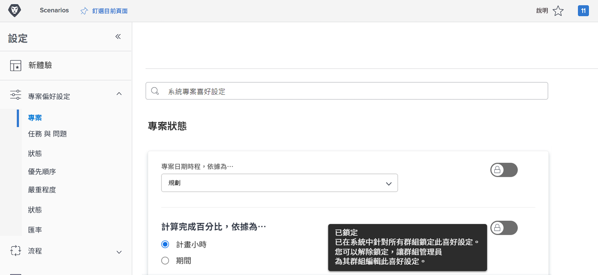
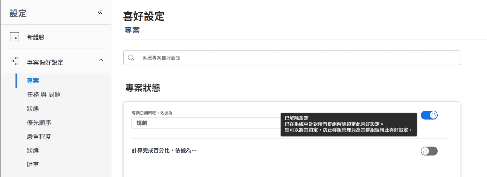
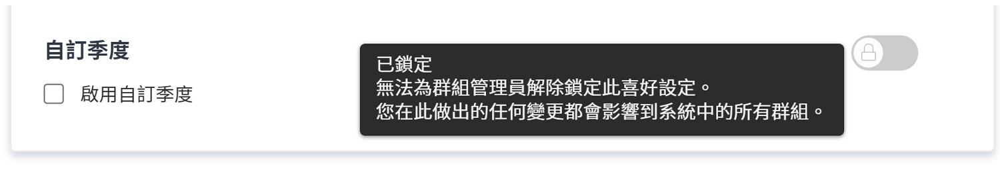

# 設定全域預設專案設定

<!---
21.4 updates have been made
--->

在本影片中，您將瞭解如何：

* 變更自訂狀態
* 設定全域專案偏好設定
* 建立及使用排程

>[!VIDEO](https://video.tv.adobe.com/v/335065/?quality=12&learn=on)

## 全域和群組專案、任務和問題設定

當您開啟 [!UICONTROL 專案] 中的設定 [!DNL Workfront]，您會注意到它顯示「[!UICONTROL 系統專案偏好設定]&quot;。 這可讓您知道這些設定會影響您的所有人員 [!DNL Workfront] 系統 — 這是全域組態。

![[!UICONTROL 專案偏好設定] 第頁於 [!UICONTROL 設定]](assets/admin-fund-system-project-preferences-1.png)

當您開啟 [!UICONTROL 任務和問題] 設定。

![[!UICONTROL 任務和問題偏好設定] 在 [!UICONTROL 設定]](assets/admin-fund-task-issue-preferences-2.png)

不過，可能並非所有群組都在 [!DNL Workfront] 需要相同的專案、任務和問題偏好設定。 例如，行銷群組希望新專案的狀態為「計畫」，而專案經理群組偏好請求狀態。

[!DNL Workfront] 可讓群組管理員調整其群組的某些專案、任務和問題偏好設定。 可調整的偏好設定取決於 [!DNL Workfront] 使用「鎖定/解鎖」切換的系統管理員。

首先，瀏覽至 [!UICONTROL 設定] 區域：

1. 選取 **[!UICONTROL 設定]** 在 **[!UICONTROL 主要功能表]**.
1. 展開 **[!UICONTROL 專案偏好設定]** 在左側功能表中。
1. 選取 **[!UICONTROL 專案]** 或 **[!UICONTROL 任務和問題]**，視您要修改的設定而定。

鎖定偏好設定以防止群組管理員調整其群組的該設定。

解鎖偏好設定，讓群組管理員可以自訂。

部分設定無法解除鎖定，且會保留全域系統設定。

### 設定群組和子群組偏好設定

對於系統管理員解除鎖定的任何設定，群組管理員可以對其管理的群組以及巢狀在這些群組下的任何子群組進行調整。 此外，群組管理員可以控制其子群組管理員可以修改的設定。

1. 選取 **[!UICONTROL 設定]** 在 **[!UICONTROL 主要功能表]**.
1. 按一下 **[!DNL Groups]** 在左側功能表中。
1. 按一下群組或子群組名稱以開啟它。
1. 選取 **[!UICONTROL 專案偏好設定]** 或 **[!UICONTROL 任務和問題偏好設定]** 在左側功能表中。
1. 針對每個已解鎖的偏好設定進行所需的變更。
1. 選取 **[!UICONTROL 儲存]**.

![[!UICONTROL 專案狀態] 區段於 [!UICONTROL 群組] 頁面](assets/admin-fund-group-preferences.png)

如果您的組織未使用群組管理員，則系統管理員可以管理不同群組的偏好設定。

<!---
learn more URLs and guides
Create or edit a group status 
Group administrators 
Configure system-wide project preferences 
Configure project preferences for a group 
Configure task and issue preferences for a group 
Create and modify a group’s schedule 
--->
