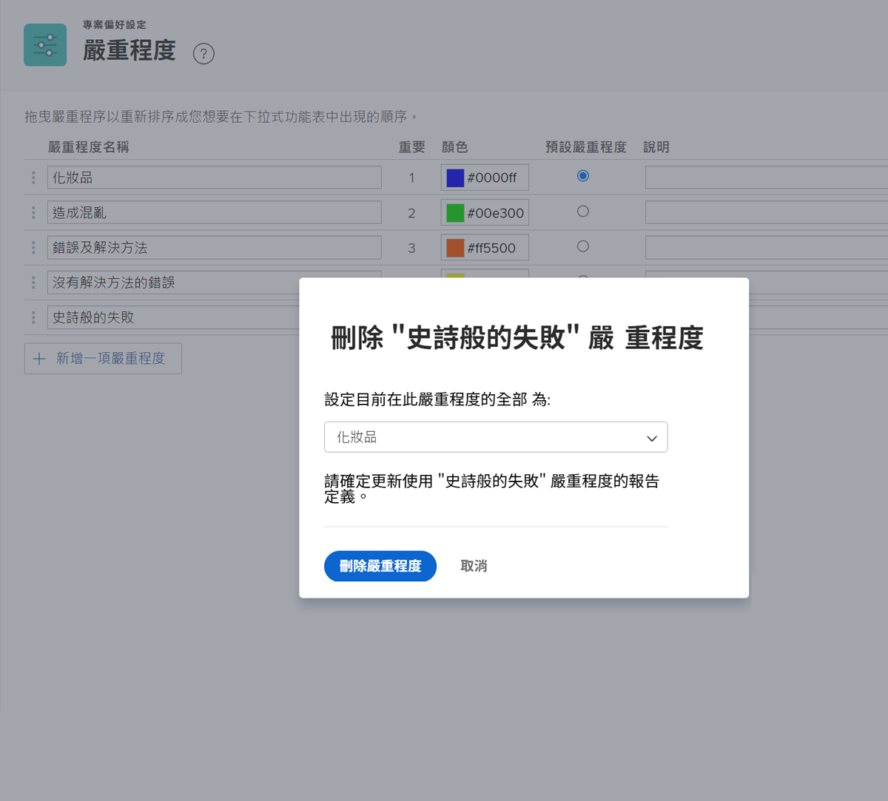

# 建立和管理問題嚴重程度

## 問題嚴重程度簡介

嚴重程度可用來指出問題的嚴重程度，或它可能對正在完成的工作產生何種影響。

![[!UICONTROL 嚴重程度] 功能表 [!UICONTROL 問題詳細資訊] 視窗](assets/admin-fund-severity-issue-details.png)

此 [!UICONTROL 嚴重程度] 欄位可在以下位置存取： [!UICONTROL 問題詳細資訊]. 它也可以包含在清單的欄檢視中和自訂報告中。

[!DNL Workfront] 具有五個預設嚴重程度：

* [!UICONTROL 輕微]
* [!UICONTROL 導致混淆]
* [!UICONTROL 有因應措施的錯誤]
* [!UICONTROL 無因應措施的錯誤]
* [!UICONTROL 致命錯誤]

如果需要，系統管理員可以重新命名這些預設嚴重性或建立新嚴重性。

嚴重程度僅適用於中的問題 [!DNL Workfront].

## 建立和管理問題嚴重程度

作為系統管理員，您可以視需要建立新的嚴重程度，以完成問題的工作流程。

![[!UICONTROL 嚴重程度] 第頁於 [!UICONTROL 設定]](assets/admin-fund-severity-section.png)

1. 按一下 **[!UICONTROL 設定]** 在 **[!UICONTROL 主要功能表]**.
1. 展開 **[!UICONTROL 專案偏好設定]** 區段。
1. 選取 **[!UICONTROL 嚴重程度]**.
1. 按一下 **[!UICONTROL 新增嚴重程度]**.
1. 為嚴重程度指定符合其預期用途的名稱。
1. 此 **[!UICONTROL 重要性]** 數字與問題的嚴重性相符。 最高數字對應於最高嚴重性。 此 [!UICONTROL 重要性] 數字必須是唯一的。
1. 選取優先順序的顏色。 這用於圖表報告和其他位置 [!DNL Workfront].
1. 指定其中一個嚴重程度選項為 **[!UICONTROL 預設嚴重程度]**. 這會自動套用至Workfront中的所有新問題。
1. 包括嚴重程度的說明，例如使用方式。
1. 在欄位外部按一下以儲存。

![[!UICONTROL 嚴重程度] 清單](assets/admin-fund-severity-new.png)

### 修改嚴重程度

如果嚴重程度不再與您的問題工作流程相關，可以重新命名、隱藏或刪除。

如果不再需要嚴重性， [!DNL Workfront] 建議您隱藏嚴重程度(按一下 [!UICONTROL 隱藏] 方塊)。 這會從問題的下拉式選單中移除嚴重程度選項，但會保留歷史資料的嚴重程度，因此仍可用於製作報表。

![[!UICONTROL 隱藏] 反白的欄 [!UICONTROL 嚴重程度] 第頁於 [!UICONTROL 設定]](assets/admin-fund-severity-hide.png)

[!DNL Workfront] 建議您 **不要** 刪除用於過去問題的嚴重程度。 當您刪除嚴重程度時，系統會要求您取代其他嚴重程度。 這可能會變更歷史資料並影響報告。

<!---
learn more URLs
Create and customize issue severities
Update issue severity
--->
