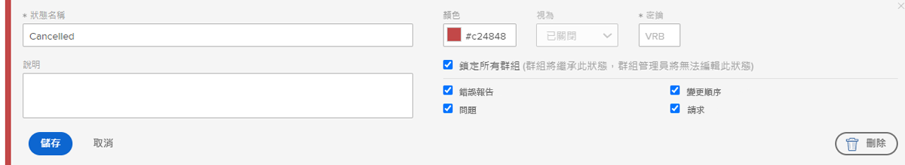
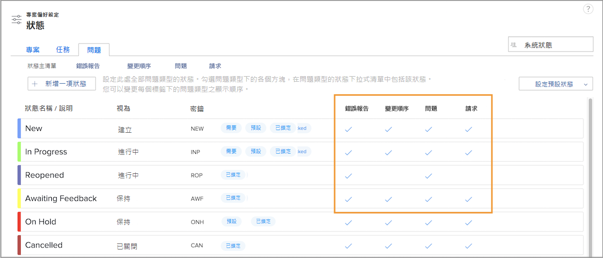

# 自訂全系統適用的狀態

[!DNL Workfront] 提供各種預設狀態來滿足貴組織問題管理工作流程的需求。這些狀態可以根據貴組織的術語重新命名。而且狀態可以指派給特定的問題類型。

如有必要，也可以建立其他狀態。唯有系統管理員才能建立全系統適用的狀態。此外，系統管理員控制群組管理員可以編輯哪些狀態。

![[!UICONTROL 問題]標籤，位於[!UICONTROL 狀態]頁面，而此頁面位於[!UICONTROL 設定]](assets/admin-fund-all-issue-statuses.png)

## 修改現有狀態

[!DNL Workfront] 建議盡量使用最少數量的狀態。這樣一來，使用者才能輕鬆選擇合適的狀態，而且要維護的狀態清單也比較簡短。

您可以編輯現有狀態來變更名稱、所指派的問題類型、相關顏色等。

![問題狀態清單的「[!UICONTROL 編輯]」選項突顯標示](assets/admin-fund-edit-issue-status.png)

1. 在&#x200B;**[!UICONTROL 主選單]**&#x200B;中按一下「**[!UICONTROL 設定]**」。
1. 展開左側選單面板中的「**[!UICONTROL 專案偏好設定]**」區段。
1. 選取「**[!UICONTROL 狀態]**」。
1. 選取「**[!UICONTROL 問題]**」標籤並確保「[!UICONTROL 系統狀態]」顯示在右上角。
1. 選取「**[!UICONTROL 主清單]**」來查看所有問題類型的狀態。您可以在這裡建立或修改問題狀態。
1. 把游標懸停在想要重新命名的狀態右側，再按一下「**[!UICONTROL 編輯]**」。
1. 為狀態指定新名稱，或是依需要變更任何其他資訊。
1. 若是這些設定應套用至您在 [!DNL Workfront] 執行個體中的所有使用者，請鎖定狀態。
1. 解鎖狀態，讓群組管理員僅可編輯其群組的狀態。
1. 勾選應套用狀態的問題類型之方塊。
1. 按一下「**[!UICONTROL 儲存]**」。

### 狀態指派

並非所有狀態都可以指派給所有問題類型。「[!UICONTROL 狀態]」頁面有多欄會顯示每個狀態可用於哪種問題類型。

若要只查看指派給特定問題類型的狀態，請按一下視窗頂端的問題類型名稱。

![[!UICONTROL 問題]標籤，位於[!UICONTROL 狀態]頁面，其中突顯標示欄](assets/admin-fund-statuses-issue-type.png)

在這裡，您可以把拖曳問題使其按照您想要的順序出現在「[!UICONTROL 狀態]」下拉式選單中。

要編輯狀態，您必須回到「[!UICONTROL 主清單]」。
