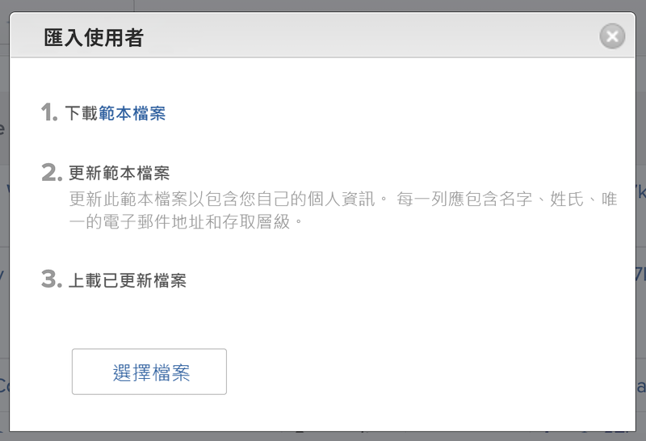
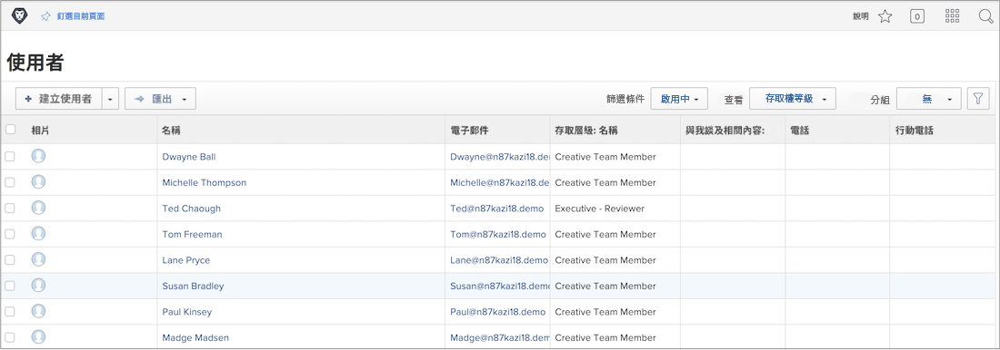

# 大量新增使用者

一次新增一個使用者可能既費時又費力。 [!DNL Workfront] 允許系統管理員使用匯入功能同時新增多個使用者。

![[!UICONTROL 導入人員] 選單選項](assets/admin-fund-adding-users-5.png)

1. 選擇 **[!UICONTROL 使用者]** 從 [!UICONTROL 主菜單].
1. 選取 **[!UICONTROL 新人員]** 按鈕並選取 **[!UICONTROL 導入人員]**.
1. 開啟的視窗會引導您建立要匯入的使用者試算表。
1. 下載範例檔案，此為 [!DNL Excel] 試算表。
1. 請依照檔案本身的指示，以使用者資訊（名字、姓氏、電子郵件地址、存取層級）更新試算表。
1. 選取 **[!UICONTROL 選擇檔案]** 按鈕。
1. 導覽至使用者試算表檔案並加以選取。

匯入的使用者會顯示在 [!UICONTROL 使用者] 清單。 視需要編輯個別或多個使用者的資訊。

## 導入用戶：使用開始

[!DNL Workfront] 提供啟動範本，以將資料匯入系統。 它也可用於匯入使用者。 在你開始之前， [!DNL Workfront] 建議您使用 [!DNL Workfront] 顧問，因為您應注意的考量事項。

<!---
paragraph below needs URL to article
--->

如需詳細資訊，請參閱透過Kick-Start將資料匯入Workfront。

![[!UICONTROL 匯入資料] ([!UICONTROL 開始])視窗 [!UICONTROL 設定] 區域](assets/admin-fund-adding-users-8.png)

<!--
Learn more URLs
Import users
Import data into Workfront via Kick-Starts
-->
