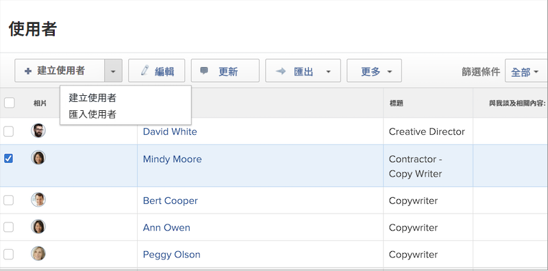

# 建立個人使用者設定檔

當僱用新員工或有人輪調到使用 [!DNL Workfront] 的部門，系統管理員只需要建立一位使用者。您可以在 [!DNL Workfront] 中的「[!UICONTROL 使用者]」區域快速、輕鬆地建立使用者。

1. 在&#x200B;**[!UICONTROL 主選單]**&#x200B;中選取「**[!UICONTROL 使用者]**」。
1. 按一下「**[!UICONTROL 新增人員]**」按鈕。
1. 在「[!UICONTROL 新增人員]」視窗中輸入使用者的名字與姓氏。
1. 輸入使用者的電子郵件地址。這是他們的 [!DNL Workfront] 登入憑證，在您的 [!DNL Workfront] 執行個體中必須是唯一的登入憑證。
1. 若您想要讓使用者接收有關新登入憑證的電子郵件，請勾選傳送邀請的方塊。
1. 為這名人員指派存取層級。這樣可以授予他們在 [!DNL Workfront] 的主要權限。
1. 指派使用者到一個主群組，確保他們可以正確存取工作。
1. 選取「**[!DNL Add this Person]**」，完成建立使用者的作業。

![[!UICONTROL 新增人員]視窗](assets/admin-fund-adding-users-1.png)

「[!UICONTROL 顯示進階選項]」連結會開啟完整的使用者詳細資料視窗。系統管理員可以在這裡設定其他組織和資源規劃資訊，例如團隊和職務角色，並且輸入使用者的個人資料 (電話號碼、工作職稱等)。

![[!UICONTROL 新增人員]視窗，出現方式是按一下[!UICONTROL 顯示進階選項]](assets/admin-fund-adding-users-2.png)

使用者可以修改其中一些資訊，但有些資訊不得修改 (視使用者的存取層級權限而定)。

## 複製現有使用者來建立新使用者

使用系統的現有使用者作為建立新登入憑證的基礎。部分現有使用者的資訊將會複製使用，但是有些資訊必須重新填寫。

1. 在&#x200B;**[!UICONTROL 主選單]**&#x200B;中選取「**[!UICONTROL 使用者]**」。
1. 選取您想要複製的使用者，只要勾選其名稱旁邊的方塊即可。
1. 選取「**[!UICONTROL 新增人員]**」按鈕上的箭頭，然後選取「**[!UICONTROL 從所選人員新增]**」。
1. 使用新使用者的資訊填為「**[!UICONTROL 個人資訊]**」區段。
1. 有些欄位是複製原始使用者的資料。請依需要變更資訊。
1. 選取「**[!UICONTROL 新增此一人員]**」。

![[!UICONTROL 新增人員]視窗](assets/admin-fund-adding-users-4.png)

<!--
Learn more URLs
Add users
-->
