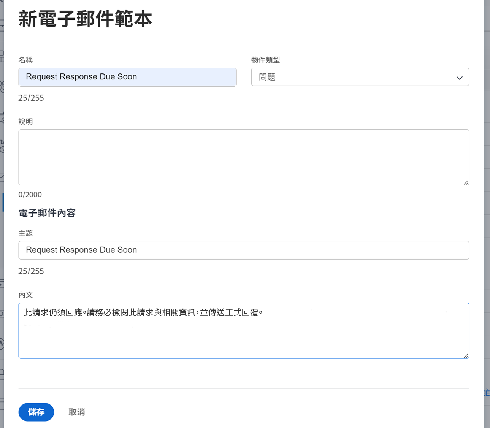

<!---
this has the same content as the system administrator notification setup and mangement section of the email and inapp notificiations learning path
--->

# 設定提醒通知

提醒通知由系統管理員在 [!UICONTROL 設定] 區域。 然後，專案、任務和問題所有者可以附加並使用它們，作為工作即將到期或過期時的提醒。

提醒是物件專屬的，必須以手動方式附加至對應的工作專案，才能傳送通知。

**建立提醒通知**

1. 按一下 **[!UICONTROL 設定]** 在 **[!UICONTROL 主要功能表]**.
1. 按一下 **[!UICONTROL 電子郵件]** 區段。
1. 按一下 **[!UICONTROL 通知]** 區段。
1. 按一下 **[!UICONTROL 新提醒]** 標籤。
1. 按一下 **[!UICONTROL +新提醒通知]** 按鈕。
1. 在下拉式選單中選取所需的物件。
1. 填入必要的資訊。
1. 按一下&#x200B;**[!UICONTROL 儲存]**。

![[!UICONTROL 新提醒通知] 視窗](assets/admin-fund-reminder-notification-1.png)

設定提醒時，請考量以下幾點：

* **[!UICONTROL 提醒通知名稱] —** 這是專案經理在物件上附加提醒時所看到的名稱。 請確定名稱簡潔但具描述性。
* **[!UICONTROL 符合資格的期間] —** 在計時區段中所選日期之前/之後的小時數、天數、周數或月數。
* **[!UICONTROL 計時] —** 選取提醒應在物件的計畫、預計或實際開始/完成日期之前或之後傳送。 時程表選項與開始日期、結束日期或上次更新日期相關。
* **[!UICONTROL 條件] —** 指定條件來限定要傳送的提醒。 選項會依物件特定的提醒而有所不同。
* **[!UICONTROL 收件者] —** 選取提醒的傳送對象。 利害關係人選項會因提醒選取的物件型別而異。

建立並儲存提醒設定後，提醒通知便可供物件擁有者使用 [!DNL Workfront].

## 電子郵件自訂

提醒通知使用預設的電子郵件格式和訊息。 如果您想要自訂電子郵件，可以建立範本。

<!---
paragraph above needs a hyperlink to an article
--->

<!---
learn more URLs
--->
