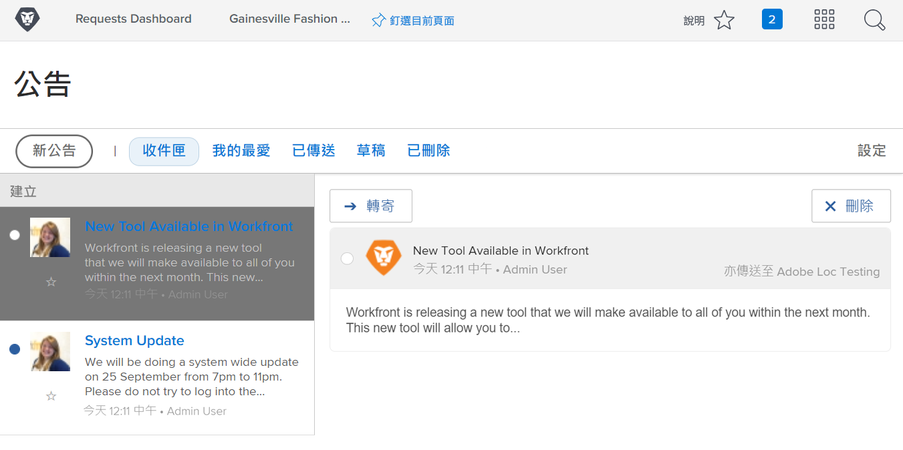

<!---
this has the same content as the system administrator notification setup and mangement section of the email and inapp notificiations learning path
--->

# 傳送[!UICONTROL 公告中心]訊息

[!UICONTROL 公告中心]是系統管理員工作的中心位置，可接收來自 [!DNL Workfront] 的通訊或是向貴組織的 [!DNL Workfront] 使用者傳送公告。

[!DNL Workfront] 對系統管理員傳送關於軟體發佈、即將到來的網路研討會、系統維護等公告。[!UICONTROL 公告中心]把所有重要資訊集中在一起，也不會被電子郵件收件匣中的其他資訊淹沒。

通知圖示顯示透過 [!DNL Workfront] 傳送的任何未讀通知和公告。清單中的公告均有標籤且可點選，若有需要您可以開啟該公告。

系統管理員還可以使用[!UICONTROL 公告中心]向使用者傳送 [!DNL Workfront] 全系統適用的訊息。您可以傳送提醒說明需要支援時可聯絡的對象、提供「每日技巧」等。

![[!UICONTROL 所有公告]連結](assets/admin-fund-announcements-2.png)

**要傳送公告**

1. 按一下「**通知**」圖示。
1. 按一下「**[!UICONTROL 所有公告]**」。
1. 按一下「**[!UICONTROL 新公告]**」按鈕。依預設，「[!UICONTROL 傳送至]」行會填寫「[!UICONTROL 所有人]」，把訊息傳送給所有 [!DNL Workfront] 使用者。您可以刪除這個資訊，並輸入使用者、職務角色、團隊、群組或公司的名稱。
1. 輸入主旨行。
1. 然後使用編輯工具按需要輸入公告的內文。
1. 按一下「**[!UICONTROL 新增附件]**」按鈕來附加要共用的檔案，若適用。
1. 按一下「**[!UICONTROL 傳送]**」。

![在「[!UICONTROL 公告]」頁面上撰寫公告](assets/admin-fund-announcements-3.png)

公告區域看起來像一個收件匣，收到的訊息會顯示在左側面板。按一下訊息來讀取內容。

