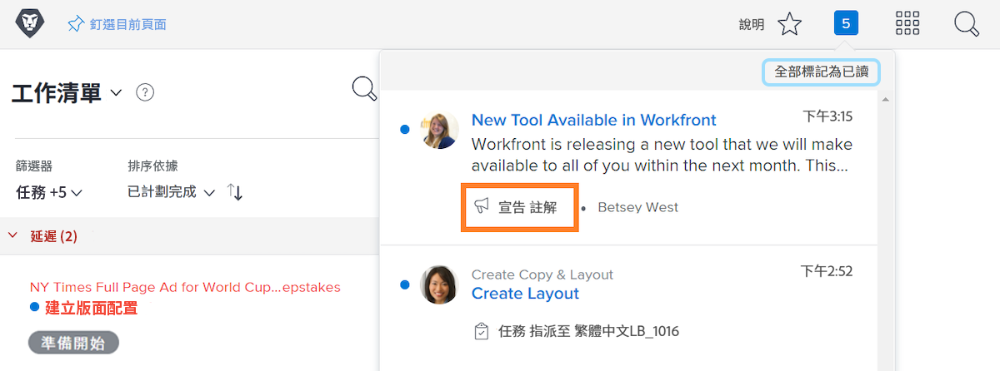

<!---
this has the same content as the system administrator notification setup and mangement section of the email and inapp notificiations learning path
--->

# 傳送 [!UICONTROL 宣告中心] 訊息

此 [!UICONTROL 宣告中心] 是系統管理員接收通訊的集中位置 [!DNL Workfront] 或傳送公告至貴組織的 [!DNL Workfront] 使用者。

[!DNL Workfront] 會傳送軟體版本、即將舉辦的網路研討會、系統維護等的公告給系統管理員。 此 [!UICONTROL 宣告中心] 將所有這些重要資訊放在一個位置，這樣您就不會在電子郵件收件匣中的其他訊息中遺失這些資訊。

通知圖示會顯示任何透過傳送的未讀取通知和公告 [!DNL Workfront]. 清單中的公告會加上標籤，如果您想開啟該清單，可點按。

系統管理員也可以使用 [!UICONTROL 宣告中心] 以傳送 [!DNL Workfront]-wide訊息傳送給使用者。 您可以傳送提醒，告知需聯絡誰以獲得支援、提供「每日秘訣」等。

![[!UICONTROL 所有宣告] 連結](assets/admin-fund-announcements-2.png)

**若要傳送宣告**

1. 按一下 **通知圖示**.
1. 按一下 **[!UICONTROL 所有宣告]**.
1. 按一下 **[!UICONTROL 新宣告]** 按鈕。 根據預設， [!UICONTROL 傳送至] 行填入 [!UICONTROL 每個人] 傳送訊息給所有人 [!DNL Workfront] 使用者。 您可以刪除此專案，然後輸入使用者、工作角色、團隊、群組或公司的名稱。
1. 輸入主旨列。
1. 然後視需要使用編輯工具輸入宣告文字。
1. 按一下「 」，附加要共用的檔案 **[!UICONTROL 新增附件]** 按鈕（如果適用）。
1. 按一下 **[!UICONTROL 傳送]**.

![撰寫公告於 [!UICONTROL 公告] 頁面](assets/admin-fund-announcements-3.png)

公告區域看起來像收件匣，已接收的訊息位於左側面板。 按一下訊息即可讀取。

