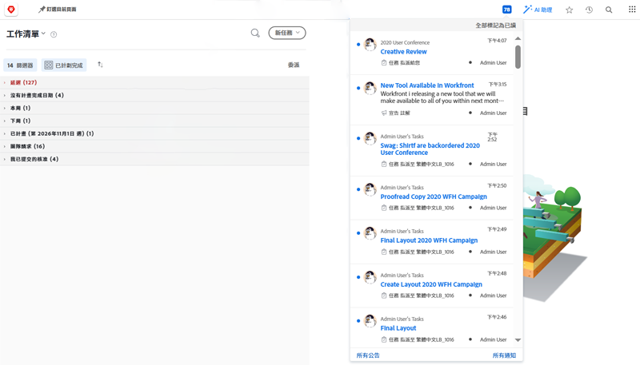
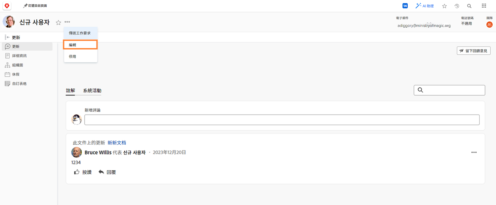

# 管理應用程式內和電子郵件事件通知

電子郵件是日常工作生活的一部分，有時候，您收到的電子郵件量會非常巨大。 不過，若使用 [!DNL Workfront]，系統管理員可確保每個人都收到有關其所參與工作的相關實用電子郵件。

Workfront可傳送給使用者的通知類型有數種。 其中有些通知是在系統層級控制，並影響所有使用者。 有些通知可設定為在每日摘要中立即產生電子郵件。 或關閉電子郵件，只產生Workfront內的通知。

## 事件通知

事件類似於狀態變更、已張貼的留言或已進行的指派，可在 [!DNL Workfront].

不過，您可以選取或取消選取偏好設定中的選項，以決定要接收電子郵件通知的事件。

若要進行這些變更，請按一下 [!UICONTROL 主菜單].

![中的使用者名稱 [!UICONTROL 主菜單]](assets/admin-fund-user-notifications-02.png)

按一下 [!UICONTROL 編輯] 從 [!UICONTROL 更多] 功能表。

按一下 [!UICONTROL 通知] 在 [!UICONTROL 編輯人員] 彈出框。

![[!UICONTROL 編輯人員] 視窗](assets/admin-fund-user-notifications-04.png)

從這裡，您可以決定要立即、每天或完全不接收哪些通知。 您在這裡所做的任何變更都是專屬於您，不會影響Workfront中的任何其他使用者。

**[!UICONTROL 每日]**

預設情況下，電子郵件設定為立即發送。 不過，您可以從 [!UICONTROL 即時] to [!UICONTROL 每日]，確保您在需要時獲得所需的資訊。

![[!UICONTROL 通知] 區段 [!UICONTROL 編輯人員] 視窗](assets/admin-fund-user-notifications-05.png)

每日選項會在一封電子郵件中傳送當天事件的摘要。 使用者會針對在 [!UICONTROL 通知] 區段。

例如， [!UICONTROL 我擁有的專案的相關資訊] 區段會產生一封每日電子郵件， [!UICONTROL 需要的操作] 區段會產生一封每日電子郵件等。

![[!UICONTROL 每日摘要] 電子郵件 [!UICONTROL 我擁有的專案的相關資訊]](assets/admin-fund-user-notifications-06.png)

![[!UICONTROL 每日摘要] 電子郵件 [!UICONTROL 需要的操作]](assets/admin-fund-user-notifications-07.png)

除了選取每日選項外，請設定這些電子郵件的傳送時間。 摘要式電子郵件可能會在您早上上班之前，或是在您離開這一天之前傳送，端視最佳運作方式而定。

![[!UICONTROL 之後的電子郵件每日摘要] 中的下拉式功能表 [!UICONTROL 編輯人員] 視窗](assets/admin-fund-user-notifications-08.png)

**完全不**

最後一個選項是完全關閉電子郵件通知。

![已在中關閉所選通知 [!UICONTROL 編輯人員] 視窗](assets/admin-fund-user-notifications-09.png)

如果您決定這麼做，請知道雖然您未收到電子郵件，但仍會在中指派、留言及更新工作 [!DNL Workfront]. 關閉所有通知後，您可能會遺漏需要注意的重要資訊。

有些情況 [!DNL Workfront] 已看到使用者關閉電子郵件通知。 例如，如果您透過 [!DNL Workfront] 行動應用程式時，您可以關閉電子郵件通知，並只透過應用程式接收通知。

無論 [!UICONTROL 事件通知] 您決定接收，通知對於完成符合您組織目標的工作是否成功至關重要。

## Recommendations

有幾項通知顯示 [!DNL Workfront] 建議您保持選中狀態，無論是即時電子郵件還是每日摘要。

對於大多數用戶：

* [!UICONTROL 我的其中一項任務的前置任務已完成]
* [!UICONTROL 有人將我加入定向更新]
* [!UICONTROL 有人對我的工作項目發表評論]
* [!UICONTROL 在指派給我的一項任務上變更了到期日期]

專為項目經理：

* [!UICONTROL 我所在的一個專案變為使用中專案]
* [!UICONTROL 我持有的專案落後]
* [!UICONTROL 向我持有的專案新增了一個問題]
* [!UICONTROL 在我擁有的項目上已完成里程碑任務]

<!---
learn more URLs
Email notifications
guide: manage your notifications
--->
