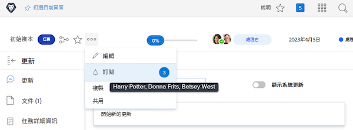

# 訂閱工作項目

事件通知會告訴您關於您受指派之工作的最新資訊。但是，有時您可能想要追蹤未指派給您的工作項目，因為其可能會影響您所做的工作。訂閱特定項目是理想的解決方案。

例如，您有興趣瞭解「初始副本」任務的進度。您並未獲得指派至這項任務，但您負責編輯該初始副本並想知道其情況。您可以訂閱該任務，並在任務有所更新時收到電子郵件通知，即時瞭解該工作的進展。

請務必注意，唯有項目上有人留下註解時才會發送訂閱電子郵件和應用程式內通知。若是發生其他動作，例日到期日修改或指派變更，並不會傳送電子郵件和通知。

若要訂閱工作項目，您必須至少擁有該項目的「視圖共用」權限。

![[!UICONTROL 任務存取]視窗](assets/admin-fund-user-notifications-11.png)

您擁有工作項目的存取後即可用以下方式訂閱：

1. 前往該專案、任務或問題的登陸頁面。
1. 按一下「**[!UICONTROL 動作]**」選單。
1. 按一下「**[!UICONTROL 訂閱]**」。

![[!UICONTROL 訂閱]選項，位於任務選單](assets/admin-fund-user-notifications-12.png)

把游標懸停在選單中「[!UICONTROL 訂閱/取消訂閱]」旁邊的數字上方，即可看見其他訂閱工作項目的使用者。

若您有工作項目的「[!UICONTROL 管理]」或「[!UICONTROL 共用]」權限，您可以用以下方式讓其他使用者訂閱專案、任務或問題：

1. 按一下「**[!UICONTROL 訂閱]**」選項旁邊的數字。
1. 新增要訂閱工作項目之人員的名稱。
1. 按一下「**[!UICONTROL 儲存]**」。

![[!UICONTROL 訂閱]視窗](assets/admin-fund-user-notifications-15.png)

您所訂閱的人員並不會收到訂閱通知。所有訂閱者均獲得該項目的「檢視」權限。但是，如果訂閱者已經擁有該項目的「[!UICONTROL 貢獻]」或「[!UICONTROL 管理]」權限，那些權限維持不變。

個別項目的「[!UICONTROL 更新]」標籤上也會有輸入項目指出訂閱的人員及時間。「[!UICONTROL 更新]」標籤也會記錄使用者被他人訂閱的情況。

![[!UICONTROL 更新]頁面 (在任務內)，顯示訂閱情況](assets/admin-fund-user-notifications-16.png)

要將使用者取消訂閱，再按一下泡泡來開啟「[!UICONTROL 訂閱者]」視窗。接著按一下人員名稱旁邊的 X。使用者不會收到已取消訂閱的通知。

![[!UICONTROL 取消訂閱]選單選項，在專案內](assets/admin-fund-user-notifications-14.png)

<!---
learn more URL: Subscribe to items in Workfront
--->
