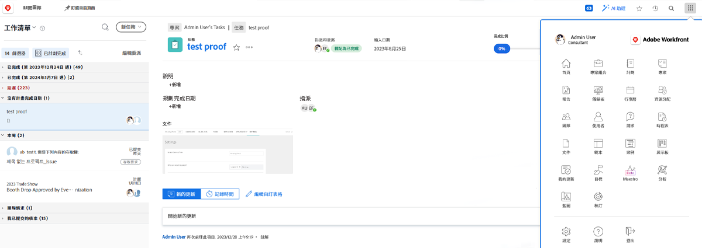
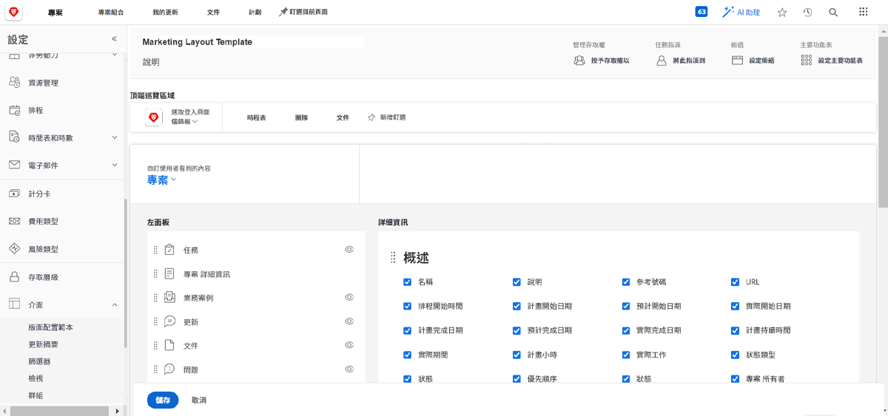
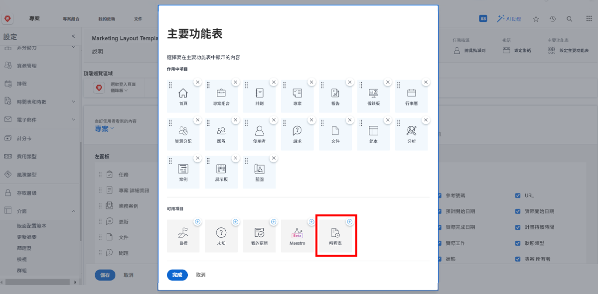

# 什麼是版面範本？

Workfront有很多好工具可協助您完成工作。 但是，太多好事可能是壓倒性的。

版面範本可讓系統管理員和群組管理員自訂使用者的體驗，並讓這些使用者專注在對他們而言重要的事。

例如，您組織中的大部分不會記錄時間。 不過，顧問團隊會向客戶收取帳單，因此他們需要記錄時間，以確保帳單的準確性。 使用佈局模板，可以為不需要時間表的用戶隱藏時間表，並為需要時間表的用戶顯示時間表。

## 建置之前

Workfront建議您在建立版面範本之前，先與使用者對話。 如果涉及將使用佈局模板的人員（如組管理員），將能夠更順暢地將正確的資訊和工具放在正確的人員面前。

並且，在建立範本後，請勿害怕進行變更。 繼續取得意見，了解他們需要哪些項目，以及想要查看和存取。 請記住，版面範本的用意是為使用者建立簡潔輕鬆的體驗。
