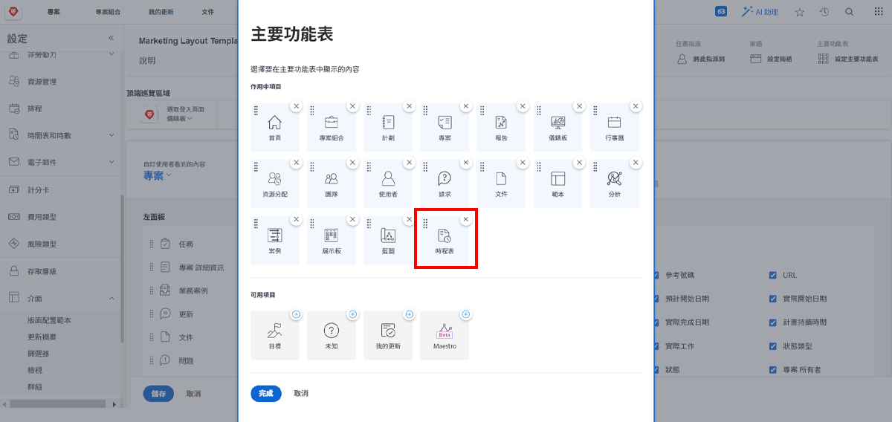

# 什麼是版面範本？

Workfront 提供許多實用工具協助您完成工作。但是好功能太多也可能讓人不知所措。

版面範本讓系統管理員和群組管理員自訂使用者的經驗，並讓使用者能夠專注於處理重要的事情。

例如，您組織中大多數人都不記錄時間。但是因為顧問團隊會向客戶計費，所以他們必須記錄時間以確保正確計費。我們可以利用版面範本，對不需要的人隱藏時程表，並對需要的人顯示時程表。

## 在建置之前

Workfront 建議在建立版面範本之前先與使用者討論。讓那些將會使用版面範本的人員 (例如群組管理員) 參與其中，提供正確的資訊和工具給正確對象之過程會變得更順利。

在建立範本之後，請放心進行變更。繼續取得他們的意見回饋，瞭解他們需要什麼、想看到和存取什麼內容。請記住，版面範本的目的是為使用者打造一個乾淨且輕鬆使用的經驗。
