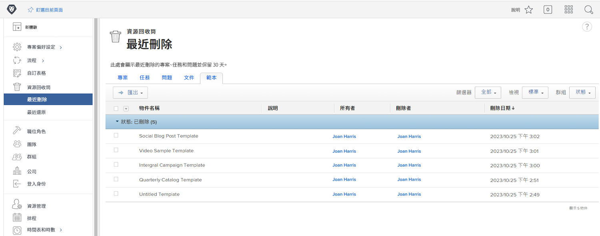
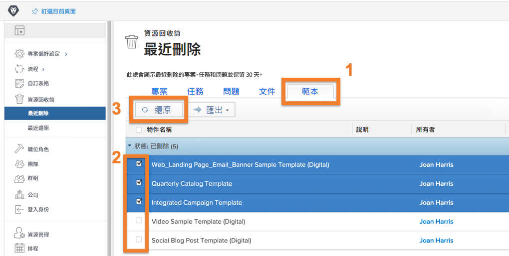
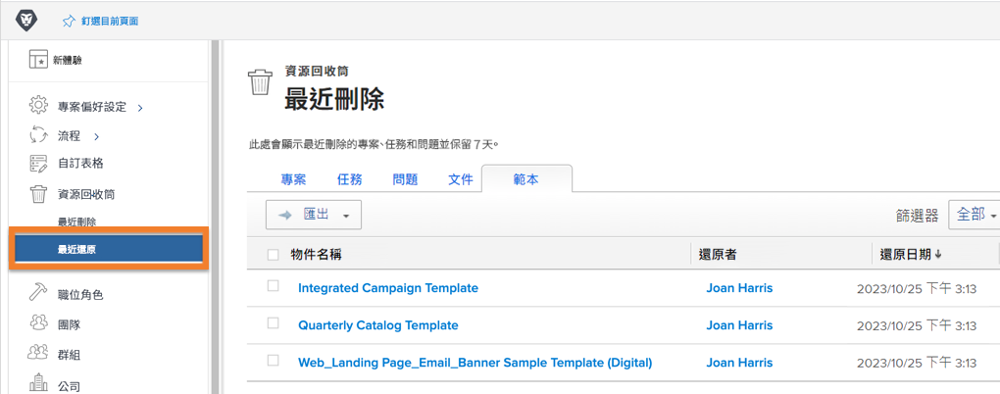

# 把放入資源回收筒的物件還原

專案工作經歷許多變更。您可以刪除某個項目，卻在 30 分鐘後才發現自己需要那個任務，或是該文件對於您要解決的問題至關緊要。

Workfront 會把被刪除的物件放在資源回收筒中最多 30 天。系統管理員可以把物件以及其所有資訊 (更新、登入時間、文件等) 還原到其在 Workfront 的原始位置。

## 還原物件

1. 在&#x200B;**主選單**&#x200B;中選取「**設定**」區域。
1. 按一下左側面板的「**資源回收筒**」。
1. 選取「**最近刪除**」。

每個可還原的物件均有一個標籤，讓您更容易找到要還原的特定項目。

1. 按一下要還原的物件之標籤。
1. 勾選物件旁邊的方塊來還原。
1. 按一下「**還原**」按鈕。

所還原的物件會短暫快顯在「[!UICONTROL 進行中]」區段。一旦畫面重新整理，物件因為已經還原，畫面上便不會再顯示。這些項目會出現在其之前位在 [!DNL Workfront] 的位置，您可以在「[!UICONTROL 最近還原]」畫面上確認。

群組管理員可以還原與所管理的群組相關聯的專案，連同與該專案關聯的任何任務、問題或文件。

<!---
learn more URL
Restoring deleted items
Viewing items that have been recently restored
--->
