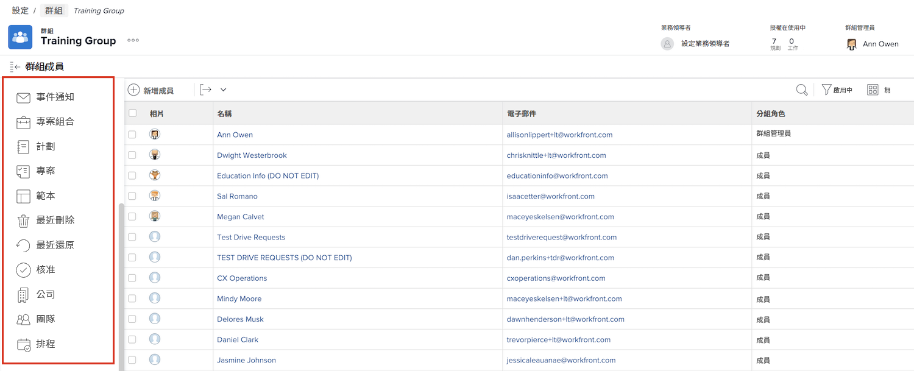

# 了解群組管理員的需求

<!---
21.4 updates have been made
--->

如果您是大型公司或擁有大量 [!DNL Workfront] 用戶，維護 [!DNL Workfront] 每個組和子組的設定可能非常耗時。

指定可在 [!DNL Workfront] 有助於在更新和維護系統時平衡負載。

群組管理員往往更符合群組的日常挑戰，因此可以管理群組的需求。 這可讓您作為系統管理員，專注於 [!DNL Workfront] 可讓貴組織整體受益的設定。

群組管理員可以在 [!DNL Workfront] 包括：

* 建立子組，並將用戶添加到子組。
* 建立其群組的版面範本。
* 為群組建立核准流程。
* 建立組級工作流狀態。
* 從群組頁面存取與群組相關聯的專案、方案和產品組合。
* 管理組級項目、任務和問題首選項。
* 管理組級時間表首選項。
* 管理群組層級事件通知。
* 以其他群組成員身分登入。
* 為組分配業務主管。
* 管理公司。

作為系統或組管理員，您可以在所管理的組和子組中建立子組。 這些子組可以被分配自己的組管理員。

>[!NOTE]
>
>一個組下有14個子組級別的限制。

**進一步了解群組管理員**

<!---
bullet points below need hyperlinks
--->

如需系統管理員、群組管理員和子群組管理員可在 [!DNL Workfront]，請參閱不同管理員類型的允許動作一文。

## 管理群組

從 [!DNL Workfront].

1. 選擇 **[!UICONTROL 設定]** 從 **[!UICONTROL 主菜單]**.
1. 前往 **[!UICONTROL 群組]** 中。
1. 選取要開啟的群組名稱。
1. 按一下左側面板中的，以開啟您要在中進行更新的區段。

<!---
learn more URLs
Create and manage groups 
Create and manage subgroups 
Business leader overview 
--->
