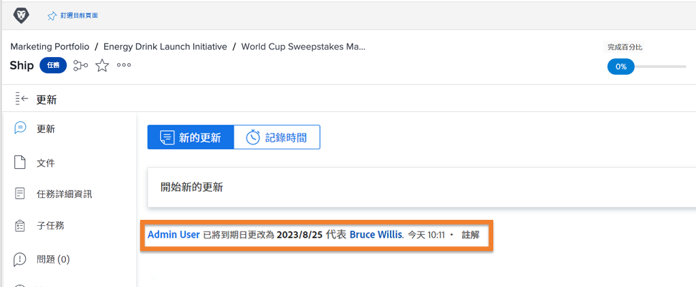

# 以其他使用者身分登入

Workfront管理員在設定使用者體驗時發現的一項功能是「登入身份」功能。 此函式位於 [!UICONTROL 設定] 區域，可讓您以其他使用者的身分登入，而無需登出您自己的帳戶。

![[!UICONTROL 登入身份] 第頁於 [!UICONTROL 設定] 區域](assets/admin-fund-log-in-as-1.png)

## 登入身份的優點

此功能之所以有用，有多種原因：

* 管理員可以預覽指派給使用者的版面配置範本，以確保功能表專案或儀表板正確顯示。
* 在工作流程測試期間，它有助於確保正確設定使用者的許可權。
* 管理員甚至可以使用此功能將任務標示為完成，或為無法完成任務的人進行核准。

## 存取登入身份

1. 選取 **[!UICONTROL 設定]** 從 **[!DNL Main Menu]**.
1. 按一下 **[!UICONTROL 登入身份]** 在左側面板中。
1. 輸入您需要登入的使用者名稱。

![[!UICONTROL 存取記錄] 定位於 [!UICONTROL 登入身份] 頁面](assets/admin-fund-log-in-as-3.png)

登入後，畫面頂端的通知會指出您所登入的使用者。

![[!UICONTROL 目前登入身份] 訊息在頂端 [!DNL Workfront] 視窗](assets/admin-fund-log-in-as-2.png)

## 更新索引標籤會追蹤活動

當管理員以其他使用者身份登入並代表該使用者進行變更/更新時，會在該特定專案的更新區域中看到變更。 以下範例顯示Joan Harris代表Roy Campbell變更到期日。

