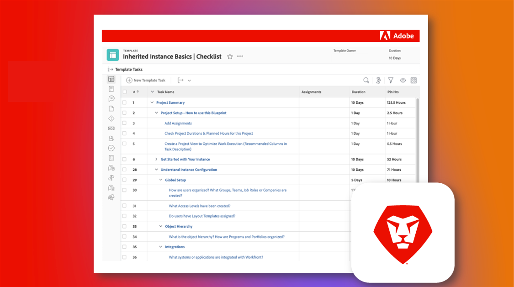

# 負責現有的Adobe Workfront執行個體

Workfront的優點在於其可自訂。 Workfront的挑戰在於，它是如此可自訂。 此外，如果您是新系統或群組、管理員並接管現有的Workfront執行個體，要瞭解其原始設定方式可能會相當困難。

不過，透過我們的繼承執行個體檢查清單，您可以瞭解有關執行個體所需的一切資訊。

  

在「繼承的執行個體」檢查清單中，您將檢閱完整的問題、資源和連結集，以清楚瞭解其設定方式。

檢查清單已建立為Workfront Blueprint和可下載的Excel試算表。 我們建議您直接在Workfront中使用Blueprint來管理和記錄您的工作。

Blueprint和試算表都是按主題組織，而非按時間表，因此您可以依照對您和您的組織最有意義的方式進行。 提供的持續時間只是範例，您應該根據特定需求進行調整。 這不必一口氣完成！

建議您儘可能與組織中的其他人員合作，檢閱和記錄這些元素，並在發生任何重大變更時保持檔案處於最新狀態。 您執行個體中的未來管理員將感謝您！

* <b>若要下載Blueprint</b>，導覽至您自己Workfront例項中的主要選單，然後選取「藍圖」 。 尋找標題為「繼承執行個體基本知識」的藍圖 |檢查清單」並按一下「安裝」。 選擇您的生產或沙箱環境，然後繼續設定。 有關安裝和設定Blueprint的更多資訊可以找到 [此處](https://experienceleague.adobe.com/docs/workfront/using/administration-and-setup/blueprints/blueprints-install.html?lang=en).

* <b>若要下載Excel</b> 檢查清單，按一下 [此處](assets/adobe-workfront-system-admin-playbook-inherited-instance.xlsx).

無論您使用Blueprint或Excel檢查清單，都可以將此程式分為3個關鍵階段：探索、稽核和檔案。 以下列出說明和理想結果。

 
 

## 第1階段：學習與探索

<b>建議的時間範圍：4週</b>

首先要瞭解您今天的Workfront執行個體設定方式。

這涉及與利害關係人面談並檢閱任何現有檔案，以瞭解您組織內的各個群組如何運用Workfront。

如果您從技術角度不熟悉Workfront，請參加系統管理員培訓。 這可提供在Workfront中不同設定如何運作及影響每個工具（並可能影響每個使用者）的必要深入分析。

在此階段結束時，您應該會：

* 清楚瞭解貴組織使用Workfront背後的原因

* 執行個體健康狀況的一般概念，包括主要使用案例

* 概述運作良好以及各種程式和使用者需求之間的挑戰和/或差距的檔案
 
 

## 階段2：系統稽核

<b>建議的時間範圍：4週 </b>

初次探索後，建議您針對執行個體進行更具技術性的稽核。 這表示您需要決定可能需要進行的變更或增強功能，以確保目前的設定和組態符合您的業務需求和需求。

在此階段結束時，您應該會：

* 深入瞭解執行個體的目前狀態

* 已識別您想要對執行個體進行的變更或增強功能，以滿足業務需求。
 
 

## 第3階段：檔案與最佳化

<b>建議的時間範圍：初始= 2週；持續更新 </b>

根據您在階段1和2中學到的內容，您將需要建立、更新及記錄執行個體，並制定藍圖以解決策略和方案層級的挑戰。

此階段進行時，您應該：

* 書面集中式檔案，可回答本檔案中各個索引標籤的問題

* 最高優先順序的工作流程、自動化和整合的視覺化圖表

* 待處理專案或藍圖記錄未來改善組織和策略挑戰的增強功能

 
透過進行每個階段，並在繼承執行個體檢查清單的協助下，您作為新的系統或群組管理員，應該對您的Workfront執行個體的設定方式、需要進行的調整或增強功能有更好的瞭解，並鞏固您的檔案以最佳化組織的Workfront體驗。

 
 

其他資訊可在以下找到：
* [網路研討會：接管繼承執行個體的秘訣](https://experienceleaguecommunities.adobe.com/t5/workfront-discussions/webinar-system-admin-essentials-tips-for-taking-over-an-existing/td-p/571873)
* [定義Workfront實作的目標](https://experienceleague.adobe.com/docs/workfront/using/administration-and-setup/get-started-administration/define-wf-goals-objectives.html?lang=en)
* [部落格：高階主管的贊助與領導力的價值](https://experienceleaguecommunities.adobe.com/t5/workfront-blogs/customer-success-tips-executive-sponsorship-and-value-to/ba-p/518353)
* [部落格： Adobe Workfront KPI簡介](https://experienceleaguecommunities.adobe.com/t5/workfront-blogs/kpi-dashboards-in-the-new-workfront-experience-introduction-to/ba-p/549001)
