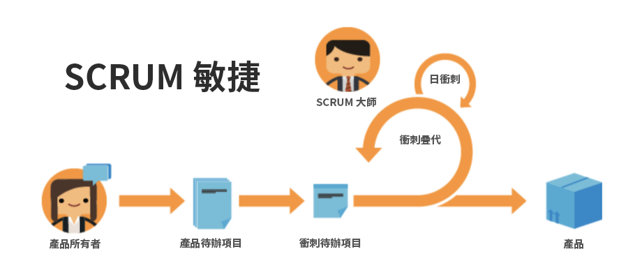

# 使用Agile的優點

## 快速調整和樞紐調整的能力

正如名稱所示，Agile方法可讓團隊具備更佳條件，以快速改變方向和重點。 軟體和營銷公司尤其了解需求變化的趨勢，這種趨勢會每週發生。 Agile可讓團隊重新評估他們正在執行的工作，並以指定的增量進行調整，以確保隨著工作和客戶環境的變化，團隊的重點也會隨之改變。

## 團隊工作的透明度

敏捷的團隊每天都會舉行「例會」，確保團隊專注於優先開發的功能或產品清單。 他們不再會感到困惑，不知道團隊中的其他人在做什麼。 他們會定期了解團隊從前一天開始所完成的工作、他們可能遇到的任何需要解決的問題/障礙，以及他們計畫在當天工作的內容。

有了這種透明和統一的方向，每個人都能更快地前進。

## 經常回饋

採用Agile的最終主要好處是在每次迭代結束時都整合了反饋迴路(請記住：迭代是團隊必須努力完成特定交付項的一組時間)。 反饋循環使團隊能夠回顧過去幾週，以確定出現了哪些問題、計畫可能在如何前進、客戶現在需要什麼（如果以前的需求已經改變）以及作為團隊吸取的教訓。
