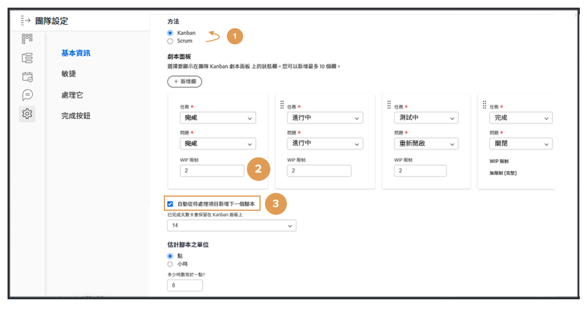
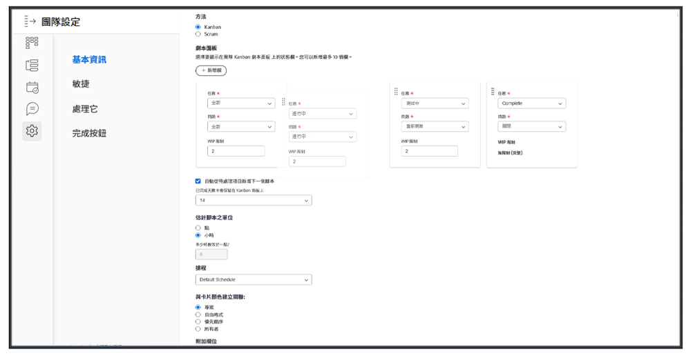
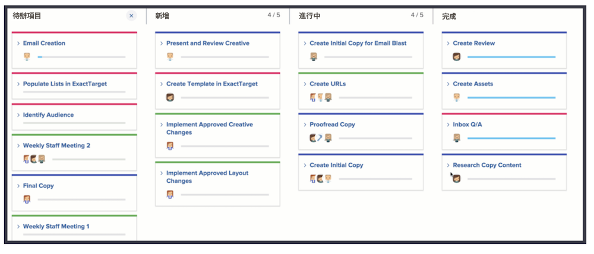
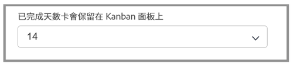

# 建立看板小組

創意行銷團隊使用Scrum已有一段時間。 他們欣賞靈活團隊的靈活環境，但他們發現很難將故事提交到特定的時間框架，因為他們團隊的優先順序變化的頻率很高。

他們確實有Scrum的替代品。 它叫看板。

看板適用於不想在基於Scrum的迭代所需的時間範圍內定義其正在處理的團隊。 相反，看板允許團隊通過其積壓持續工作。

讓我們將創意行銷團隊從Scrum團隊切換為看板團隊 [1]. 在「團隊設定」的「敏捷」區段中進行此變更。

更改方法後，您需要通過調整「WIP限制」來指定看板小組在每列中一次可以擁有多少層。 [2]. WIP代表進行中的工作。 您選擇放置的數量取決於團隊可以處理的活動項目數量。 它將顯示在團隊的情節提要上，以幫助提醒他們是否分配過度。 您（以及具有編輯權限的團隊的任何成員）也可以從序列影像板中更改WIP限制。

請注意，您可以拖放狀態欄，依您希望的順序排列。

看板團隊還可以選擇在文章完成時讓積壓工作的下一個文章自動出現在情節提要上 [見上圖第3位]. 這有助於偏好持續工作週期的團隊。

下圖顯示了當新文章在文章完成時自動出現在情節提要上時的外觀。

為協助您更有效率地管理已完成的工作，預設會在展示板上停留14天。

如有需要，可在團隊設定視窗中將該設定調整為1至30天。

請記住，儘管這是一種不同的方法，但在敏捷的環境中工作時，通過討論故事要求和調整故事優先順序來持續整理積壓工作仍然很重要。 每當您想要重新排定積壓工作的優先順序時，您需要將一個頁簽移至「積壓工作」頁簽以重新排列它。
