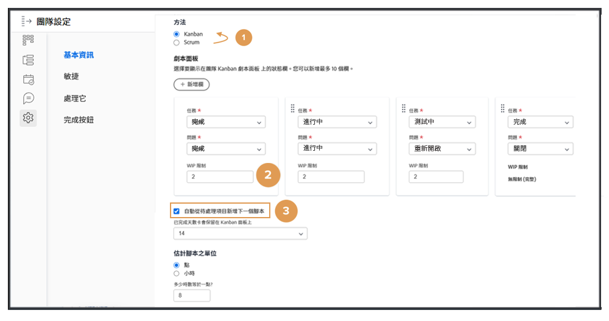
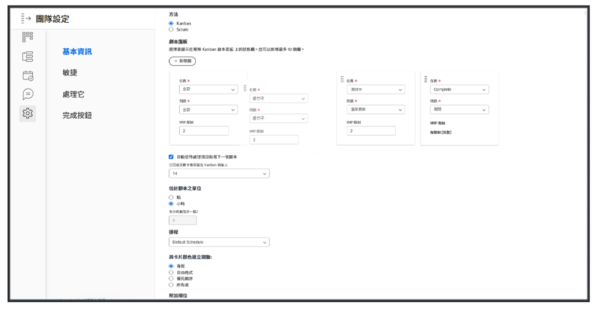
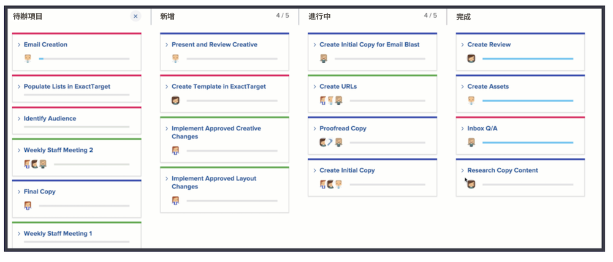
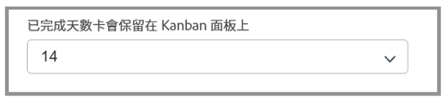

# 建立看板團隊

創意行銷團隊使用 Scrum 已有一段時間。 他們欣賞敏捷團隊的彈性環境，但是由於其團隊的優先事項經常變動，他們發現自己無法在指定的時間範圍內執行故事。

他們採用 Scrum 的替代方案。 該方案就是看板。

團隊如果不想要依照 Scrum 型疊代的要求，定義自己在指定時間範圍內所做的工作，則看板適合他們使用。 與 Scrum 不同，看板利用待辦項目讓團隊可以持續處理工作。

我們把創意行銷團隊從 Scrum 團隊轉換成看板團隊[1]。 在「團隊設定」的「敏捷」區段進行這項變更。

變更方法後，您需要透過調整「在製品限制」，指定Kanban團隊在每個欄中一次可以有多少個劇本。[2]。 WIP 是「Work in Progress」(進行中) 的縮寫。 您在這裡選擇的數字，取決於團隊可能處理多少個進行中的項目。 數字會顯示在團隊的分鏡腳本中，協助提醒他們是否配置過多工作量。 您 (以及具有編輯權限任何團隊成員) 亦可以直接從分鏡腳本更改 WIP 限制。

請注意，您可以拖放狀態欄並按照您希望的順序放置。

看板團隊也可以選擇，在一個故事完成時，讓待辦項目中的下一個故事自動出現在分鏡腳本上 [請參閱上方影像號碼 3] 這項功能對於喜歡連續性工作週期的團隊有所幫助。

以下影像顯示在一個故事完成時分鏡腳本上自動出現新的故事的畫面。

為了更有效管理已完成的工作，依預設設定，故事會保留在展示板上 14 天。

如有必要，在團隊設定視窗中可以調整該設定為 1 至 30 日之間。

請記住，雖然這是不同的方法，但是在敏捷環境中工作，務必要透過討論故事需求與調整故事優先順序，持續完成待辦項目中的工作。 若您想要重新排列待辦項目的優先順序，您必須把某個標籤移動到待辦項目標籤上方來重新排列。
