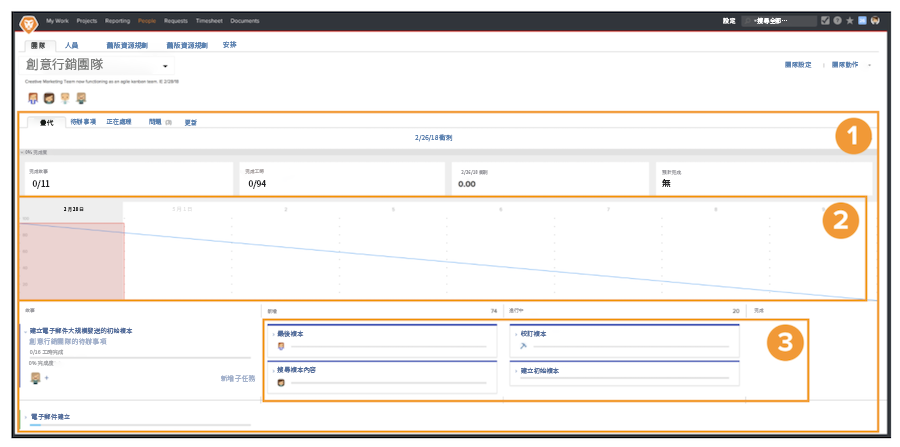

# 建立 Scrum 敏捷團隊

## 組成 Scrum 團隊

Workfront 中的敏捷團隊負責完成疊代頁面的工作[1]。位在頁面頂端的燃盡圖[2]是本次疊代迄今為止所有進展的概觀。燃盡圖下方是本次疊代中團隊承諾執行的故事[3]。

觀看這段影片，您將瞭解如何建立敏捷團隊、選取 Scrum 方法以及確定 Scrum 團隊的設定。

### 從頭開始組成 Scrum 團隊

您現在已經知道完成設定之後的樣子，便可以直接瞭解如何在 Workfront 中進行設定。讓我們使用一家稱為 Swains 的公司之案例研究來示範如何設定。您負責創意團隊的運作，並且您已經同意創意行銷團隊改採敏捷方式。

這個團隊已經決定要採用 Scrum 方法，因為他們很喜歡分鏡腳本提供的極高可見度，方便瞭解每個人正在進行的活動，以及工作項目目前處於什麼狀態或階段。能夠規劃短期疊代，正好滿足他們目前的工作需求。團隊通常需要進行為期 2 至 3 週的行銷活動，因為必須能夠優先處理團隊在這麼短的時間內可以執行或處理的事情。

## 在 Workfront 中建立 Scrum 敏捷團隊

觀看這段影片，您將瞭解如何：

- 建立敏捷團隊
- 選取 Scrum 方法
- 確定 Scrum 團隊設定

>[!VIDEO](https://video.tv.adobe.com/v/346281/?quality=12&learn=on&enablevpops)

您想把 Workfront 中現有的團隊轉換為敏捷團隊？沒問題！前往「團隊設定」並勾選「這是一個敏捷團隊」方塊。

## Scrum 團隊設定變更

團隊設定頁面中已不再包括「在這個問題標籤上顯示」選項，因為敏捷團隊不再需要「問題」標籤。指派給團隊的問題放在「待辦項目」標籤下，規劃包含任務和問題的疊代時更方便。
