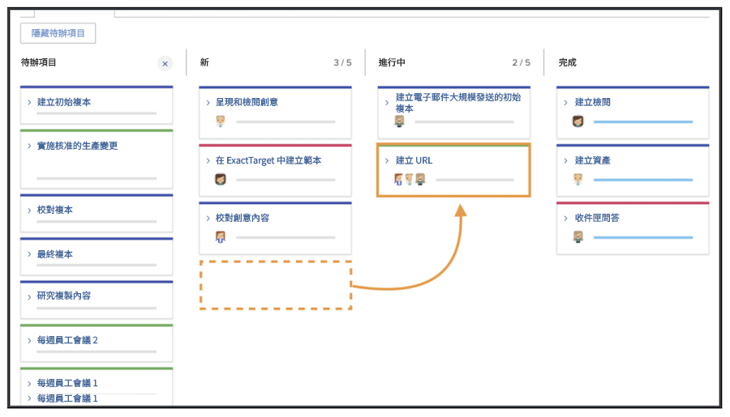
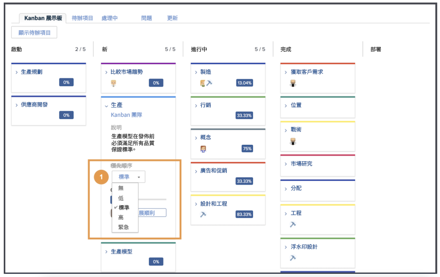
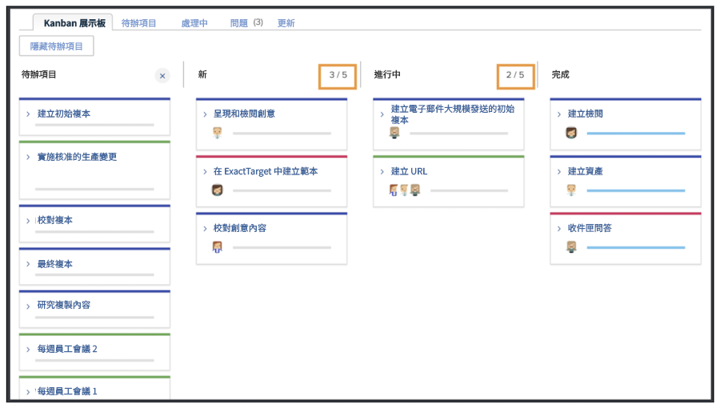
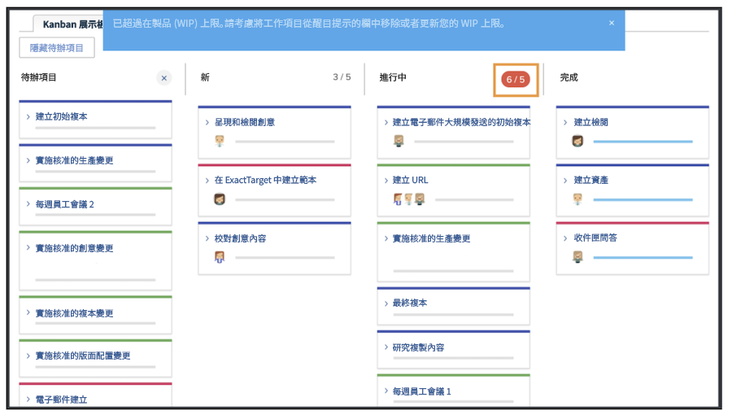

# 作為Kanban團隊管理工作

以看板團隊身分管理工作將劇本新增至看板待辦專案有多種方式可以將劇本新增至創意行銷團隊的待辦專案。

團隊可以直接從他們的待處理專案新增劇本。
他們也可以被指派專案上的任務。 如果創意行銷團隊將請求路由給他們，這些請求將顯示在團隊的「請求」索引標籤中。 如果團隊選取請求並將其轉換為劇本，這些將會顯示在團隊的待辦專案中。

## 使用Kanban面板

將待處理專案中的劇本排定優先順序後，就可以移至Kanban展示板了。 您可以將正在處理該劇本的團隊成員的頭像拖放到劇本卡上，以進行指派。

隨著故事的進度，團隊會將故事移動到故事板上的適當狀態。 團隊成員可以使用Kanban旗標來指示內文是「正在進行」、「已封鎖」或「準備提取」。 這會傳達給其他團隊成員，他們的工作專案正在追蹤中，並且他們是否準備好工作。

團隊成員也可以更新故事板上的卡片，以反映描述、狀態或優先順序等等的變更。 他們可透過按一下內文卡上的下拉式選單並對適當欄位進行編輯來完成此操作 [1].

## Kanban劇本執行

請注意，您使用的創作中作品限製為5個劇本。 檢視您的展示板，您會看到當您將任務移入狀態列時，每個通道中的任務數量會顯示在每個狀態列的右上方。

如果狀態列超過等於「新增」或「進行中」的限制，您會收到一則錯誤訊息，指出您已超過進行中工作的限制。

如果您的團隊決定他們一次可以處理更多或更少專案，您（和其他擁有編輯許可權的成員）可以按一下WIP編號並編輯它以反映您的新決定，從分鏡指令碼中變更「進行中工作」編號。
