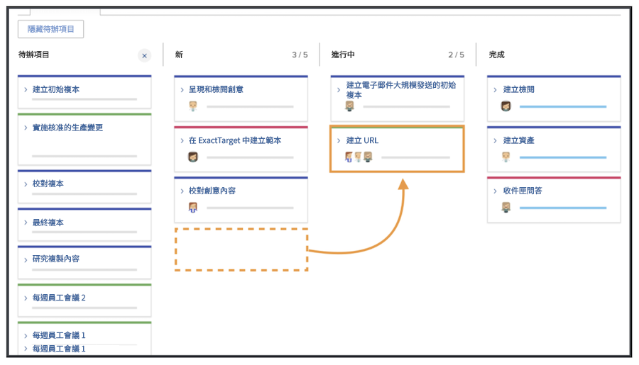
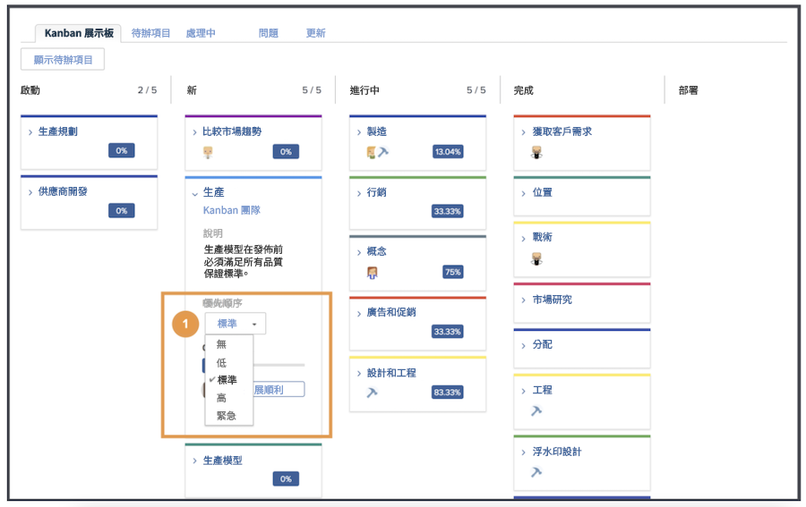
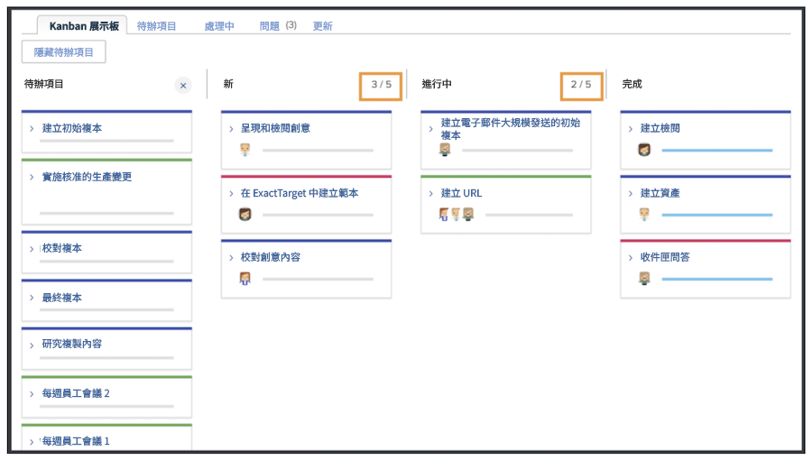
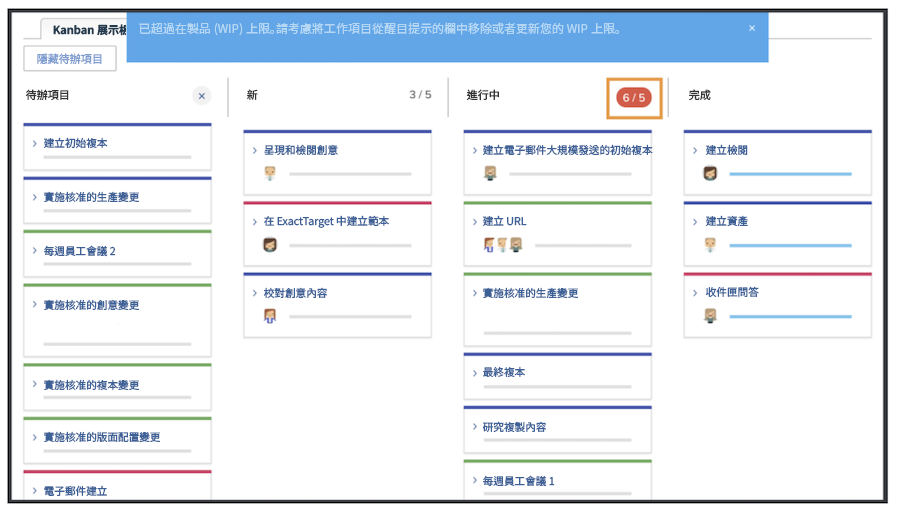

# 看板團隊之工作管理方式

看板團隊之工作管理方式
將劇本新增至Kanban待辦專案
您有多種方式可以將劇本新增至Creative行銷團隊的待辦專案中。

團隊可以直接新增取自待辦項目的故事。
您也可以指派他們執行專案上的任務。 如果創意行銷團隊收到發送給他們的請求，在該團隊的「請求」標籤中會顯示這些請求。 如果團隊選取該請求並將其轉換為故事，團隊的待辦項目中便會出現這些內容。

## 使用看板展示板

在待辦項目中的故事確定優先順序之後，便要移到看板展示板。 您可以把將要執行該故事的團隊成員之顯示圖片拖放到故事卡上，藉此進行工作指派。

隨著故事的進展，團隊將把故事移動到分鏡腳本中適當的狀態。 團隊成員可以使用看板標幟來表示故事為「進展順利」、「停滯」或「準備好啟動」。 這樣可以讓其他團隊成員知道哪些工作項目進展順利，以及是否準備好可供執行。

團隊成員也可以在分鏡腳本上直接更新卡片的內容，以反映如說明、狀態或優先順序等事項之變更。 按一下故事卡上的下拉式選單，然後在適當的欄位進行編輯，便可以做到上述更新[1]。

## 執行看板故事

請注意，您所使用的「工作進行中」狀態限制最多五個故事。 查看展示板上內容，您會發現當您把任務移至其他狀態欄時，每一個狀態欄的右上方會顯示每一道的任務數量。

如果您在等於「新增」或「進行中」狀態欄的任務數量超出上限，便會看到錯誤訊息，指出您已經超出工作進行中的數量限制。

若您的團隊決定他們一次可以處理的項目變多或變少，您 (和具有編輯權限的其他團隊成員) 可以直接在分鏡腳本上變更「工作進行中」的數量，只要按一下 WIP 數量並編輯，即可反映您的新決定。
