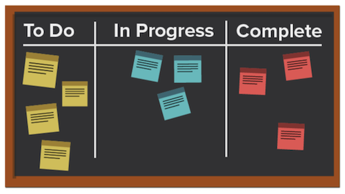
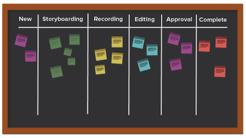

# 介紹看板方法及其運作方式

與其他專注於循環流程的敏捷方法不同，看板方法專注於工作流程最佳化。 透過使用看板展示板將工作視覺化、限制處於「進行中」狀態的工作量，以及分析流程以利持續進行改善，看板希望藉此改善工作的流程。

一起了解看板的主要元素。

## 關鍵成員

看板團隊中的關鍵成員與 Scrum 團隊類似，但是沒有 Scrum Master。 由某個人擔任專案經理人或主管仍是合理的做法，但理論上這個角色應在有需求的時候自然產生。

## 視覺化：看板展示板

看板展示板有很多種格式化的方式。 團隊在可以擁有任何欄數的展示板上作業。 每一欄代表所執行工作的狀態。

在最簡化的展示板中，第一欄可能是「待辦」，第二欄是「進行中」，而第三欄是「完成」。

許多公司使用自己的術語為欄命名，甚至可能列出流程中每個步驟，但大家的意圖都相同。 團隊成員根據工作的狀態將他們的故事從一個欄移動到另一欄。

## 確定優先順序

團隊成員與產品經理或專案經理人合作，確保待辦項目和其他狀態欄中的故事均優先處理，而且工作朝向完工持續進展。 產品經理仍然負責確保客戶的意見獲得重視而且產品朝正確的方向發展。

## 限制進行中的工作量

看板有一個獨特的功能，可允許團隊設定其產能上限，限制在任何指定時間內可以處理的故事數量。 團隊會按照本身意願在「待辦」和「進行中」欄位放入特定數量的故事，但他們不會處理超過該數量的任務以避免過度疲勞。 某個故事只要移到「完成」，待辦項目中的故事便會取代該故事在「待辦」欄的位置。

## 持續改進

看板為團隊提供測量工作效益的系統，協助他們持續改進。 團隊可以清楚看到其工作流程的運作方式、工作流程每個部分需要多少時間，以及準時交付成果的頻率。 這樣一來，便可以輕鬆試驗各種工作方式以達到最佳輸出。
