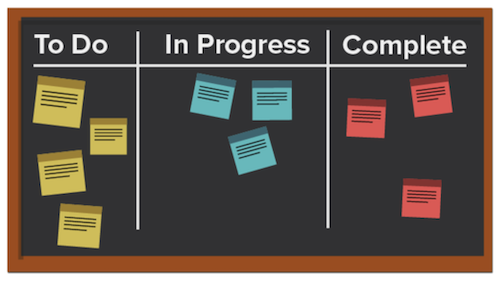

# 什麼是Kanban方法以及如何運作？

與其他著重於週期性程式的敏捷方法不同，Kanban方法著重於最佳化的工作流程。 Kanban希望透過視覺化工作來改善工作流程，利用Kanban面板、設定可處理的工作量限制，以及分析流程以進行持續改進。

讓我們來瞭解Kanban的一些關鍵元素。

## 主要玩家

Kanban團隊中的主要玩家與Scrum團隊中的主要玩家類似，但沒有Scrum主人。 擔任專案經理或主管可能仍然有意義，但理論上，這個角色應該會在需求出現時自然出現。

## 視覺效果：Kanban面板

有許多方式可格式化您的Kanban面板。 團隊在可以有任意數目的欄的主機板上運作。 每一欄代表正在完成的工作的狀態。

在最簡單化的展示板中，第一欄可能是「待辦事項」，第二欄可能是「進行中」，第三欄可能是「完成」。

許多公司對於欄名稱都有自己的術語，或者他們甚至可能會列出流程中的每個步驟，但目的相同。 團隊成員會根據工作的狀態在不同欄之間移動他們的劇本。

## 優先順序

專案團隊成員與產品經理或專案經理合作，以確保未交訂單和其他狀態列中的劇本已排定優先順序，且工作會繼續向前推進至完成。 產品經理仍然負責確保客戶聲音被聽到，產品朝著正確的方向移動。

## 限制在製品

Kanban的一個獨特方面是團隊對於他們可以在任何給定時間處理的劇本數量有容量限制。 團隊會在「待辦事項」和「進行中」欄位中選擇一定數量的故事，並且不會為了防止倦怠而超過該數量。 一旦劇本移至「完成」狀態，待辦專案中的劇本就會出現在「待辦事項」欄中。

## 持續改善

Kanban提供系統，讓團隊測量其成效，藉此持續改善。 他們可以清楚瞭解其工作流程如何運作、每個工作流程片段所需的時間，以及他們準時收到交付專案的頻率。 這可讓您更輕鬆地嘗試以不同方式執行作業以最佳化輸出。
