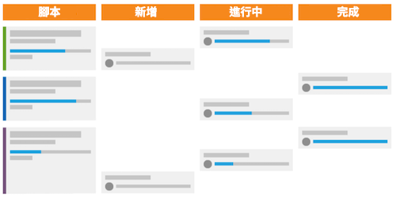

# 什麼是 Scrum 方法以及其如何運作？

Scrum 方法包含彈性模式，但與其他方法不同之處在於它明確指定團隊成員的角色，例如產品所有者、Scrum Master 等。對於工作的定義和完成方式亦有明定的實務做法。

## Scrum 團隊概觀

當您決定是否改用 Scrum 時，您必須瞭解團隊的結構，看看他們是否可以輕鬆轉移到新方法。Scrum 團隊由三種成員組成：產品所有者、Scrum Master 和團隊成員。

### 產品所有者

產品所有者擁有產品，並且對產品的現狀和未來有願景。他們是客戶的代言人，也是業務決策和確定產品功能優先順序的主要推手。

### Scrum Master

Scrum Master 協助團隊尋找完成工作所需的資源，並在團隊之間達成應盡可能提高工作效率之共識。他們還能在整個過程中促進溝通與達成共識。

### 團隊成員

團隊通常是跨職能的，其成員具有許多不同的職務角色和技能。他們負責規劃、執行和交付產品的增量功能。他們因為事實上位在相同的地點或是能夠存取讓共同作業更快更簡單的工具，不論是日常工作中成員的互動以及每天的團隊站立會議，均能從中受益。

## Scrum 團隊工作方式

您把這些關鍵成員集結起來起後，他們便會依循全新風格的工作流程來完成工作和交付產品給客戶。同樣的，與傳統或瀑布方法相比，他們將不再遵循先制定最終產品的計劃，然後經歷交付產品所需的各個步驟和階段之線性流程。相反的，Scrum 團隊會先建立待辦項目。

### 建立待辦項目

Scrum 團隊先研究需優先交付的特色功能和所需功能的清單，稱為故事。他們必須詢問客戶並以團隊的形式討論對於所要建置的系統或產品有什麼要求/需求。

待他們建立主要故事之後，便要整理待辦項目。作為一個團隊，他們必須經歷四個主要步驟。

* 討論每個故事需要完成的工作，並藉此把大型故事拆分為小型增量要求。

* 將他們的故事排定優先順序，並決定哪項功能要先行開發。

* 闡明認定故事完成的要求和驗收條件。

* 預估團隊要完成每個故事和待辦項目所需付出的精力。這項預估可用小時或是點數為單位。您可以利用點數說明故事的難度或複雜度，而不是規劃故事中每個元件所需的時間。

### 疊代規劃

在待辦項目整理完成並確認優先順序後，便要開始計劃疊代。(許多組織會將「衝刺」和「疊代」兩個詞互換使用。)團隊會根據認定為準備就緒的故事，決定要完成哪個故事。團隊進行指派並決定疊代的期間。

### 執行疊代

現在應該開始執行疊代了。團隊成員就像傳統團隊一樣開始工作，但他們現在加入一個簡短的每日會議，稱為站立會議。

團隊成員將以站立方式進行這個簡短的會議並回答三個問題：

* 我昨天完成哪些工作？
* 今天我要完成什麼工作？
* 他們遇到哪些阻礙致使指派無法有所進展？

這些會議讓每個人都達成共識并快速前進。

## 使用燃盡圖和分鏡腳本來追蹤進度

當團隊在站立會議中回答三個主要問題時，他們必須監視和追蹤疊代完成的進度。他們可以藉由這樣的動作，確認完成各個故事的速度是否夠快，以便在疊代結束時準時交付所有功能。Scrum 流程中有兩個元件可以完成此任務。

### 分鏡腳本

團隊可以利用分鏡腳本讓他們的故事隨著狀態欄的變更，即顯示工作項目為「新增」、「進行中」或「完成」來向前移動。

### 燃盡圖

燃盡圖可用於監視團隊是否以足夠快的速度完成故事。燃盡圖可用於個別疊代或整個產品版本。

