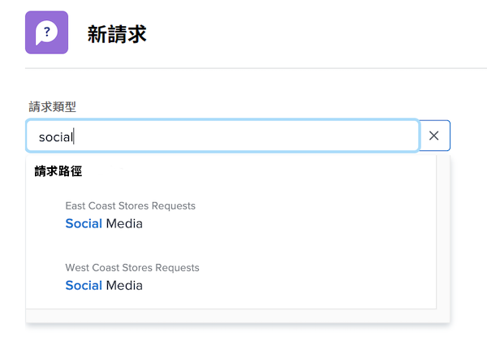

# 提出請求

在此影片中，您將學習如何：

* 導覽至請求區域
* 提出請求
* 查看提交的請求
* 查找請求草稿

>[!VIDEO](https://video.tv.adobe.com/v/336092/?quality=12)

## 快速輕鬆地存取請求佇列路徑

當您按一下 [!UICONTROL 請求類型] 欄位中，最近提交以自動顯示在清單頂端的最近三個請求路徑。 選取選項，將另一個請求檔案至該佇列。

清單底部是您有權存取的所有請求佇列。 如果您不確定要用於請求的佇列，請使用關鍵字搜尋來快速輕鬆找到您需要的佇列。

當您輸入關鍵字時， [!DNL Workfront] 帶出相符項目，方便您找到符合需求的請求佇列路徑。 例如，若要請求社交媒體貼文，請開始在 [!UICONTROL 請求類型] 欄位和清單會動態更新，以顯示任何相符項目。

選擇您想要的選項、填寫申請表，然後提交申請。

<!---
Learn more
Requests area overview
Create and submit Workfront requests
Guides
Make a work request
--->
