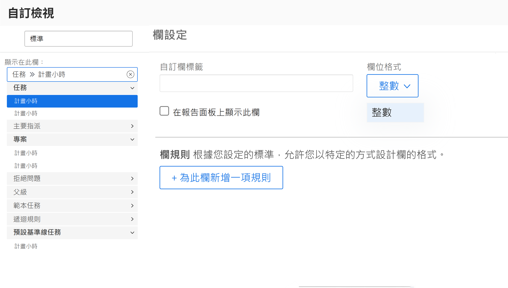
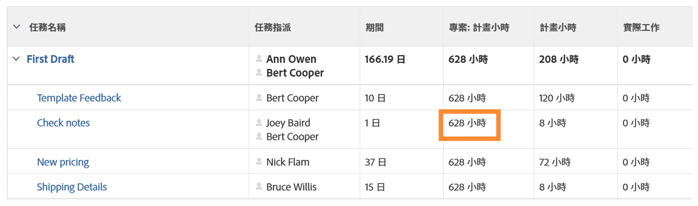

# 建立 SUB、SUM、DIV 或 PROD 資料運算式

觀看這段影片，您將會瞭解：

* SUB、SUM、DIV 和 PROD 運算式的功能
* 如何在計算欄位中建立 SUB 資料運算式

>[!VIDEO](https://video.tv.adobe.com/v/335177/?quality=12&learn=on)

## 其他資訊：ROUND 運算式

### 建立 ROUND 運算式

ROUND 運算式將任何數字四捨五入到一定的小數位數。

大多數情況下，ROUND 資料運算式會搭配另一個資料運算式，而且在格式欄位為「文字」或「數字」時使用。

我們來建立一個計算欄位，確定規劃時數與任務實際記錄時數之間的差異，而這個欄位將需要使用 SUB 運算式，如下所示：

**SUB({workRequired},{actualWorkRequired})**

由於追蹤時間以分鐘為單位，而偏好的格式是以小時為單位，運算式的結果也必須除以 60，如下所示：

**DIV(SUB({workRequired},{actualWorkRequired}),60)**

若在自訂表單中建立計算欄位時格式變更為「數字」，當您在視圖中新增欄位時可以變更數字格式。

但是，如果建立自訂表單時欄位格式為「文字」，則在視圖中無法輕易變更格式。您必須使用 ROUND 運算式，避免在專案中看到類似這樣的數字：

<b>在計算欄位中使用 ROUND 資料運算式</b>

ROUND 運算式包含運算式名稱 (ROUND) 以及兩個資料點，這是指一般情況。這些資料點可能是運算式或是 Workfront 中的欄位，後面帶有數字，表示您想要有多少個小數位數。

運算式的結構如下：ROUND(data point, #)

在計算規劃時數與實際時數的差異的運算式中，請使用 DIV(SUB({workRequired},{actualWorkRequired}),60) 運算式作為第一個資料點。接著確保該運算式產生的任何數字，在小數點右側不會產生超過兩個位數。

運算式可以寫成這樣：ROUND(DIV(SUB({workRequired},{actualWorkRequired}),60),2)。
