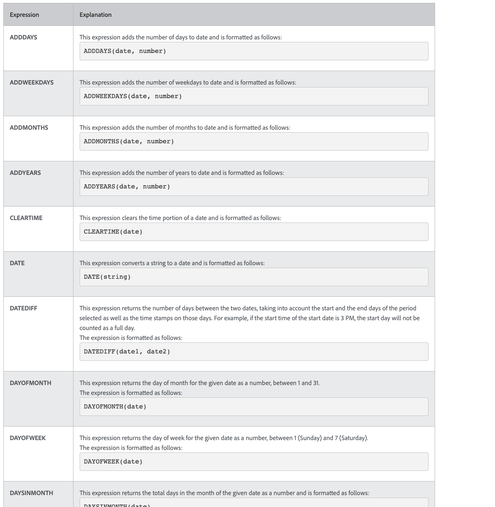
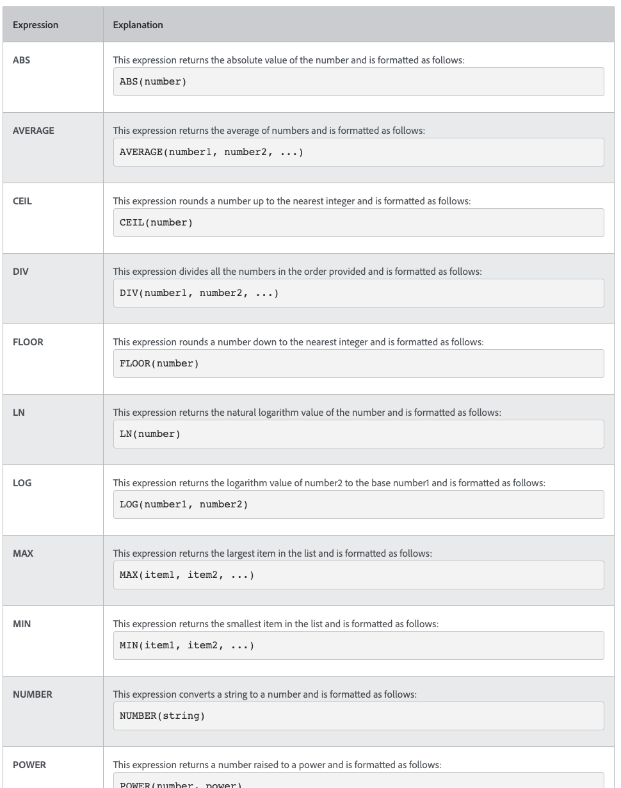

# 了解日期與時間及數學運算式

## 日期和時間運算式

日期和時間運算式可讓您將重要日期提取到報表的最前沿、自動計算完成任務所花費的工作天數，或在不需要時間戳記時從檢視中移除時間戳記。

查看可用的日期和時間運算式時，您會找到數個可用選項。

有兩個日期和時間運算式集最常被使用 [!DNL Workfront] 客戶：

* ADDDAYS/ADDWEEKDAY/ADDMONTHS/ADDYEARS和
* DATEDIFF / WEEKDAYDIFF

## 數學表達式

數學表達式允許 [!DNL Workfront] 自動執行計算，無論是簡單還是複雜。

查看可用的日期和時間運算式時，您會發現有數個可用選項。

[!DNL Workfront] 客戶通常使用這兩個數學運算式集：

* SUB, SUM, DIV, PROD
* ROUND
