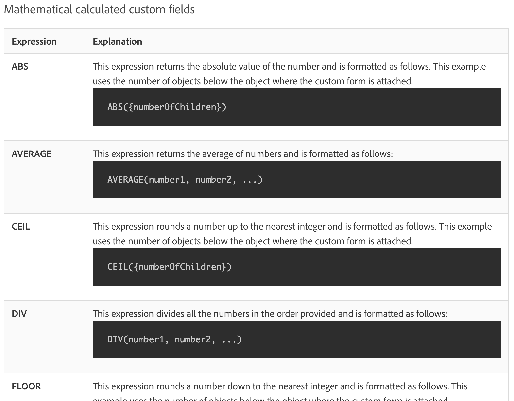

# 瞭解日期和時間以及數學運算式

## 日期和時間運算式

您可以使用日期和時間運算式在報告最重要的位置呈現重要的日期，自動計算完成任務所需的工作日數，或者刪除視圖中不需要的時間戳記。

查看可用的日期和時間運算式時，您會發現數個可用選項。

[!DNL Workfront] 客戶最常使用兩種日期和時間運算式組合：

* ADDDAYS/ADDWEEKDAY/ADDMONTHS/ADDYEARS 以及
* DATEDIFF / WEEKDAYDIFF

## 數學運算式

[!DNL Workfront] 可以利用數學運算式自動執行計算，無論是簡單或複雜的計算。

查看可用的日期和時間運算式時，您會發現數個可用選項。

Workfront 客戶通常使用這兩個數學運算式組合：

* SUB, SUM, DIV, PROD
* ROUND

>[!NOTE]
>
>如需運算式的完整清單和每個運算式的詳細資訊，請前往[計算資料運算式](https://experienceleague.adobe.com/en/docs/workfront/using/reporting/reports/calculated-custom-data/calculated-data-expressions)檔案頁面。

