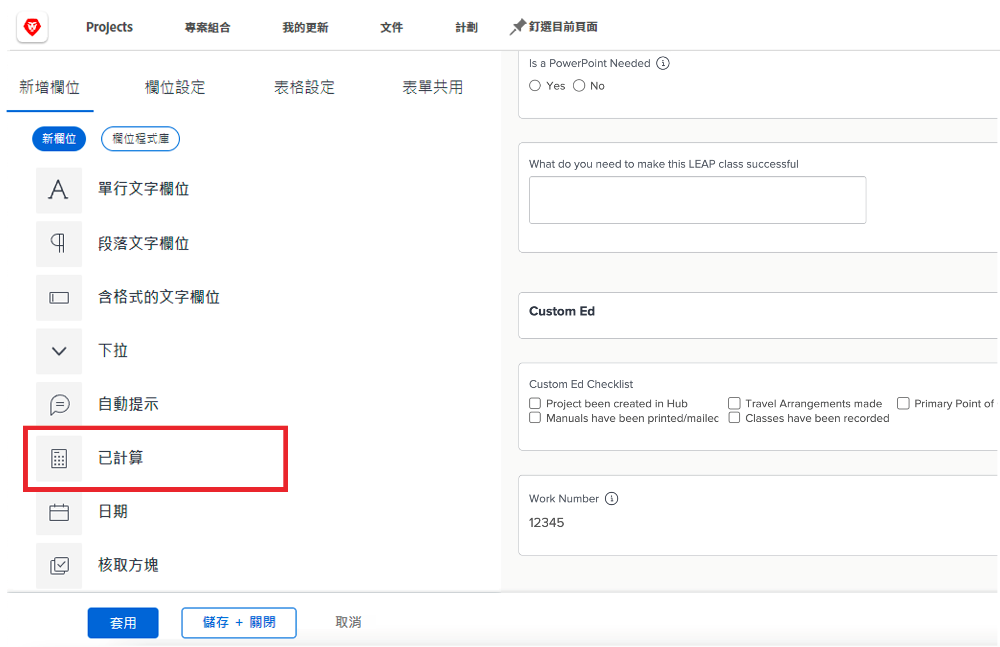
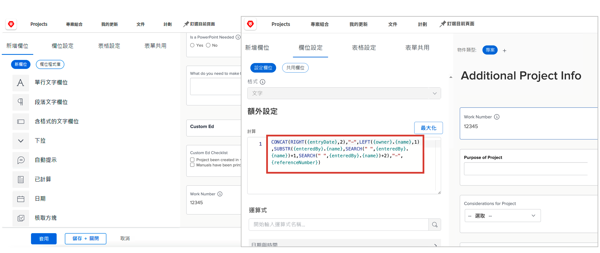
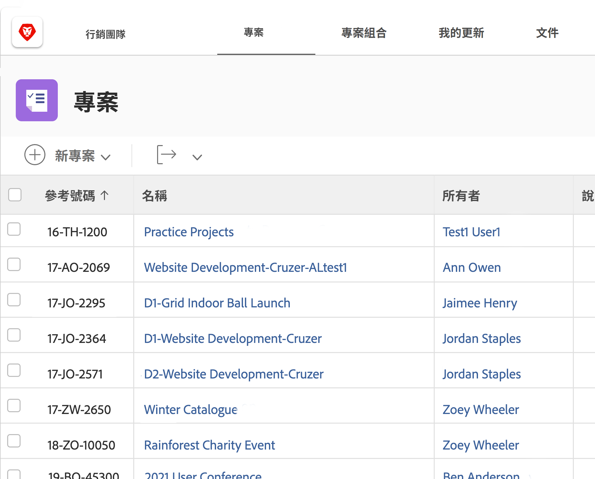

# 開始使用計算欄位和運算式

<!-- **Note**: The expression examples shown are simple and some may be mitigated by fields already supplied by  . However, the examples are used to illustrate the foundational knowledge needed in order to build expressions in Workfront.-->

Workfront 提供在多個業務領域常見的，而且經常用於工作管理的各種欄位。例如規劃完成日期、專案預算、任務受指派者名稱等欄位。

然而，各個組織都有所屬產業和公司的特定資料，我們必須收集這些資料才能瞭解是否達成公司目標。例如，您的組織想要追蹤：

* 專案對於哪一個業務線有貢獻。
* 其資金來自供應商、內部或兩者皆有。
* 所使用的影像需要什麼解析度。

雖然這些欄位並不是 [!DNL Workfront] 固有的內建欄位，但是您可以使用自訂表單建立自訂資料輸入欄位以及預先填入多重答案選項的欄位。

此學習路徑著重於計算欄位。您將瞭解什麼是計算欄位、透過資料運算式可以從計算欄位提取的不同類型資訊，以及如何建立那些計算欄位來改善資料收集和報告。

## 什麼是計算欄位？

計算欄位儲存使用資料運算式和現有 Workfront 欄位建立的自訂資料。

例如，您的組織有特定的專案編號或工作編號系統，其中包括：

* 專案建立年份
* 專案所有者的姓名縮寫，以及
* [!DNL Workfront] 專案參考編號。

在計算欄位中使用運算式，您可以提取已經儲存在 [!DNL Workfront] 的資訊並建立唯一的專案 ID 或工作編號，並在之後新增到報告中，如下所示：

根據所需的特定資料而定，計算欄位可以是使用一或兩個運算式的簡單欄位，或是使用數個內嵌運算式的複雜欄位。請記住，Workfront 的計算欄位只能使用已儲存或提取到系統中的資料。

## 文字運算式

文字運算式會搜尋、拆解分析和結合在 [!DNL Workfront] 中找到的資訊，建立更具有意義的資料，或是對於貴組織所執行的工作提供更深入的分析。

例如，您可以這樣使用文字運算式：

* 當專案費用超過 $5,000 時，在專案視圖的一欄顯示「超過 $5,000」，或是當費用未達該金額時顯示「低於 $5,000」。

* 為每個專案設定一個唯一編號，其中包含建立專案的年份、[!DNL Workfront] 參考編號、專案名稱和專案所有者姓名縮寫。

* 建立一份報告，列出未指派給專案組合和/或方案的每個專案，以便您可以在管理員會議中使用。

自訂欄位可以使用文字運算式在 Workfront 執行這些類型的搜尋與結合。

在檢視可能使用的文字運算式時，您會發現數個選項。

以下是六種最常使用的文字運算式：

* CONCAT
* LEFT / RIGHT
* CONTAINS
* IF
* ISBLANK