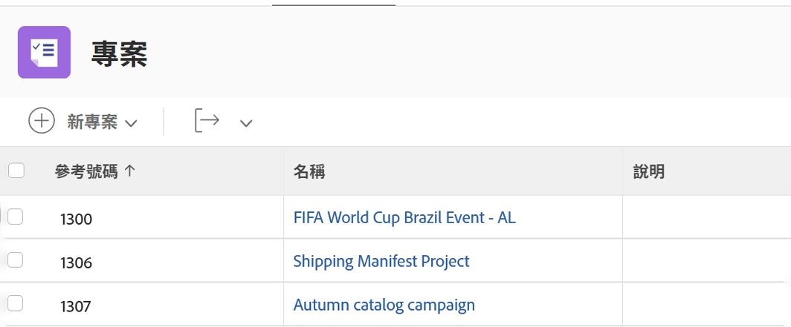
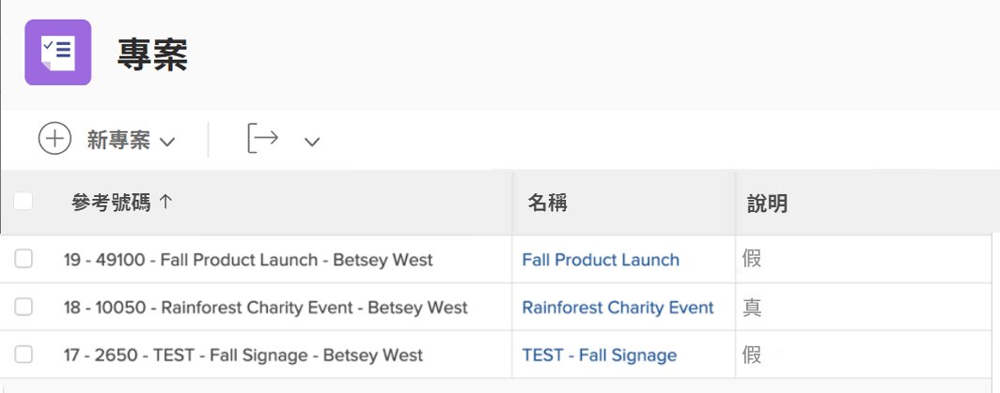
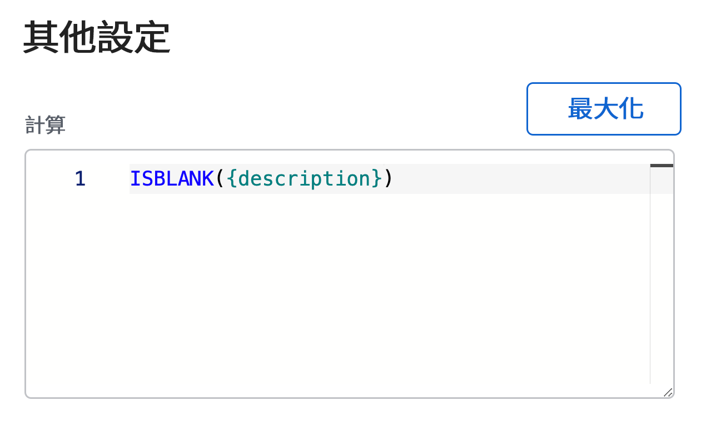
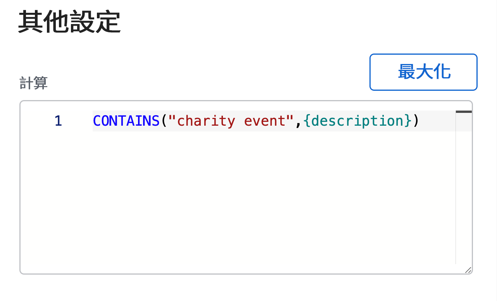

# 使用 ISBLANK 和 CONTAINS 運算式

CONTAINS 和 ISBLANK 運算式都用於提供簡單的 true 或 false 值。兩者的區別在於 ISBLANK 運算式檢查欄位是否含有任何值，而 CONTAINS 文字運算式則是在欄位中搜尋特定字串。

例如，要查看專案是否有說明，請使用 ISBLANK 運算式。如果說明欄位是空白，則運算式會傳回 true 值。如果說明欄位不是空白，則會傳回 false 值。

要在說明中搜尋特定值，例如「charity event」，請使用 CONTAINS 文字運算式。若是在說明中找到「charity event」，則計算欄位表示「true」。若是沒有找到「charity event」，則顯示「false」。

## ISBLANK

ISBLANK 文字運算式包括運算式的名稱及一個資料點。

**ISBLANK({data point})**

在上述範例中，您想要知道專案是否有說明，則運算式如下：

ISBLANK({description})

## CONTAINS

CONTAINS 文字運算式包含運算式的名稱、您要搜尋的字詞或短句，以及要搜尋的欄位。

**CONTAINS(&quot;phrase&quot;,{fields})**

在要搜尋的字詞或短句前後必須加上引號，否則便不是有效的運算式。

在上述範例 (在專案說明中搜尋「charity event」) 中，運算式如下：

**CONTAINS(&quot;charity event&quot;,{description})**

**備註**：CONTAINS 運算式區分大小寫。例如，如果「Charity Event」在說明欄位中有大寫字母，在運算式中的短句也要使用大寫。

**CONTAINS(&quot;Charity Event&quot;,{description})**

若您想要搜尋是否存在某個值，則 ISBLANK 和 CONTAINS 運算式皆適用。但是，知道該值是什麼意思、看到實際的值或是擁有某些描述項來提供更深入的分析，可能更有用處。

例如，您不只是想要知道專案是從請求轉換而來，而是想要知道原始請求的名稱。

在這種情況下，請使用 CONTAINS 運算式結合 IF 運算式。

ISBLANK 和 CONTAINS 文字運算式經常與 IF 文字運算式一起使用。
