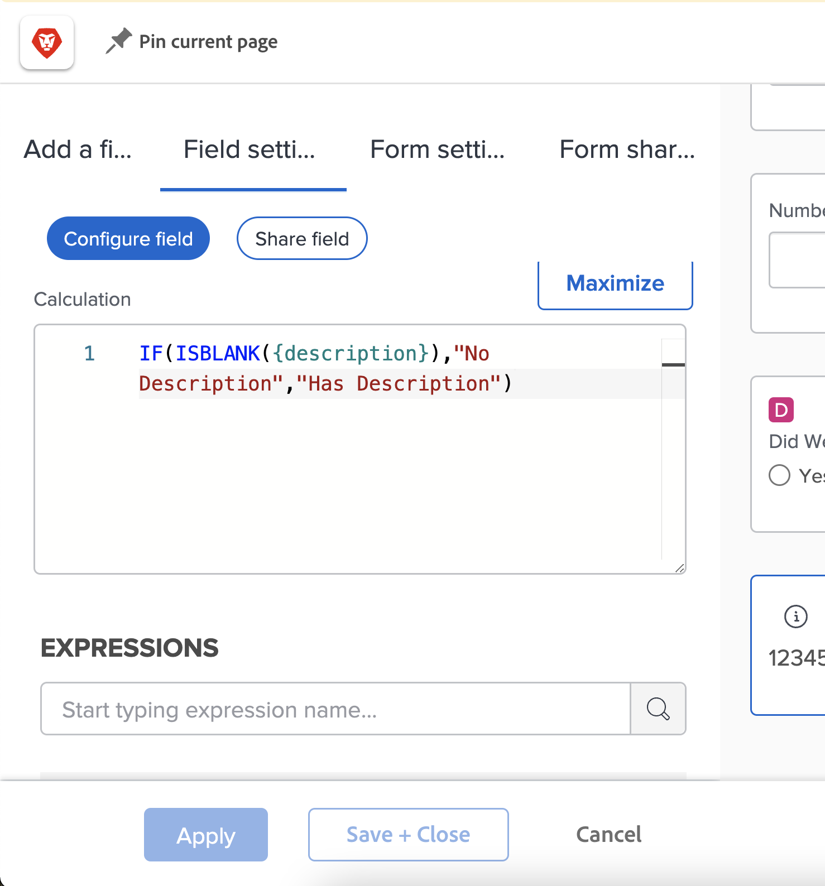
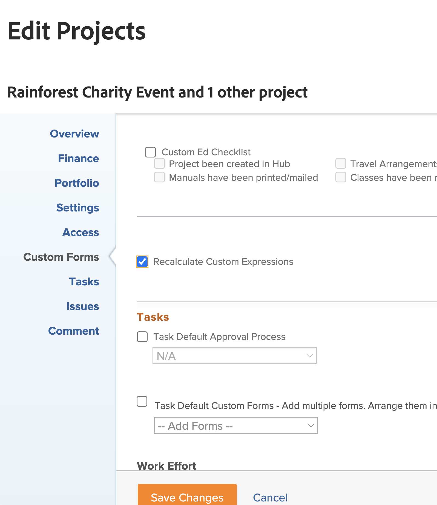

# 關於計算欄位運算式的須知事項

以下是使用Workfront中的自訂計算欄位時最熟悉的概念清單。

## 表達式名稱中的大小寫事項

當涉及到表達式名稱時，大小寫很重要。 起初撰寫運算式名稱時，您可以使用大寫、小寫或兩者的組合。

但是，必須將表達式寫成所有大寫字母，系統才能識別表達式並保存欄位。

## 小時數以分鐘為單位儲存

Workfront資料庫中的小時數以分鐘為單位儲存。 如果您參考「計畫小時數」或「實際小時數」欄位，請除以60以小時而非分鐘顯示時間。

## 間距不影響表達式

建議使用寫入運算式的方式，是在每個運算式之間間隔很小到沒有。

* IF(ISBLANK({description}),&quot;No Description&quot;,&quot;Has Description&quot;)

不過，如果間距有助於您了解目前的情況，則可在運算式中新增一些間距。 額外空格不應阻止運算式收集或計算 [!DNL Workfront].

* IF(ISBLANK({description}), &quot;No Description&quot; , &quot;Has Description&quot;)

只有欄位和大括弧不能包含空格。 否則，您會收到錯誤訊息，且無法儲存欄位或自訂表單。

## 引號必須是直的

在運算式中使用引號時，請確定引號為直(&quot;)。 如果引號是彎曲的(&quot;)，則 [!DNL Workfront] 系統將繼續顯示「自訂運算式無效」訊息。

## 表單儲存和物件編輯時更新計算

這是計算欄位中需了解的重要方面。

除非重新計算自訂表單，否則計算欄位中顯示的資訊將保持不變並過時。

可使用對象的「更多」(More)菜單中的「重新計算表達式」(Recalculate Expressions)選項刷新表達式。

您想要查看問題已開啟的天數。 使用表達式DATEDIFF建立名為「Days Open」的計算欄位。

* 欄位名稱=開啟天數
* 表達式= DATEDIFF({entryDate},$$TODAY)

儲存後，在Workfront中首次建立或輸入問題的間隔天數，以及今天的日期，可顯示在物件的詳細資訊頁面或報表檢視中。

在隔天檢視相同的詳細資料頁面或報表檢視時，您預期該數字會增加一。 如果今天是5，明天應該是6。 第二天應該是7，然後是8等。

不過，欄位會繼續每天顯示5。 欄位必須「重新執行」或重新計算，才能重新整理資訊。

要使用「重新計算表達式」選項更新欄位，請執行以下操作：

* 按一下物件的名稱以開啟它。
* 按一下「更多」功能表。
* 從清單中選擇「重新計算表達式」。

您也可以使用清單或報表中的「大量編輯」功能，同時重新計算多個運算式。 假設您建立了一個報表，其中顯示「未結天數」計算出現在欄中的問題清單。 如果要一次重新計算所有問題：

* 選取報表中的所有問題。
* 選取編輯選項，以大量編輯所有選取的問題。
* 按一下左側的自訂Forms標籤，向下捲動至自訂表單區段。
* 勾選「自訂Forms」區段底部的「重新計算自訂運算式」方塊。
* 按一下「儲存變更」 。

螢幕會重新整理，在計算欄位中顯示更新的資訊。

**附註**:雖然在計算欄位中有更新或重新計算運算式的其他方法，但這是最快速且最簡單的方式。

## 在同一欄位內，計算可能因表單而異

在自訂表單上儲存計算欄位並儲存自訂表單時，計算欄位會新增至欄位庫，以便用於其他自訂表單。

不過，如果您在表單A上有計算欄位，在表單B上有相同的計算欄位，初始的想法是計算完全相同。 情況並非總是如此。 表單A上的計算欄位可能計算表單B上的方式完全不同。

從欄位庫中選取計算的自訂欄位並新增至自訂表單時，會新增欄位，但計算空白。 發生此情況的一個原因是，計算可能引用了其他對象類型不存在的欄位。

例如，您已建立「完成天數」計算欄位，以判斷完成專案中的工作所花的時間。

* WEEKDAYDIFF({actualStartDate},{actualCompletionDate})

要對迭代執行相同操作。 您可以使用相同的運算式；但是，任務對象的可用欄位不一定可用於迭代對象。 So [!DNL Workfront] 讓您有機會使用正確的物件欄位來建立計算。

**專業提示**:建立自訂欄位時，將計算運算式從「計算」方塊複製到「指示」欄位。 從欄位庫將計算的自訂欄位新增至自訂表單時，不會清除此欄位。

視需要而定，自訂表單中的計算欄位可能相當簡單或非常複雜。 運算式可內嵌或巢狀內嵌其他運算式和值，以提供所需的詳細程度，以便更清楚掌握組織中正在執行的工作的進行。

<!--Depending on the need, calculated fields in custom forms can be quite simple or very complex. Expressions can embed, or nest, other expressions and values to provide the level of detail needed to get a better picture of what is going on with the work being done at your organization. 

Most of the examples and exercises in this course have been relatively simple to provide a base understanding of the expressions most commonly used and how to build those expressions in a custom calculated field. 

Now you’re ready to start building your own calculated custom fields.-->
