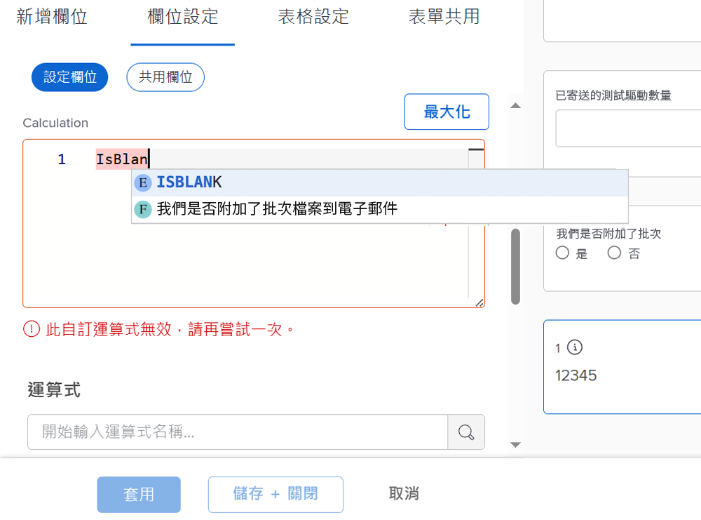
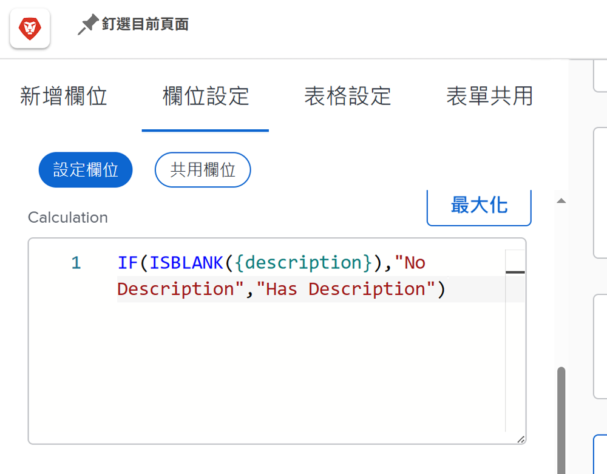
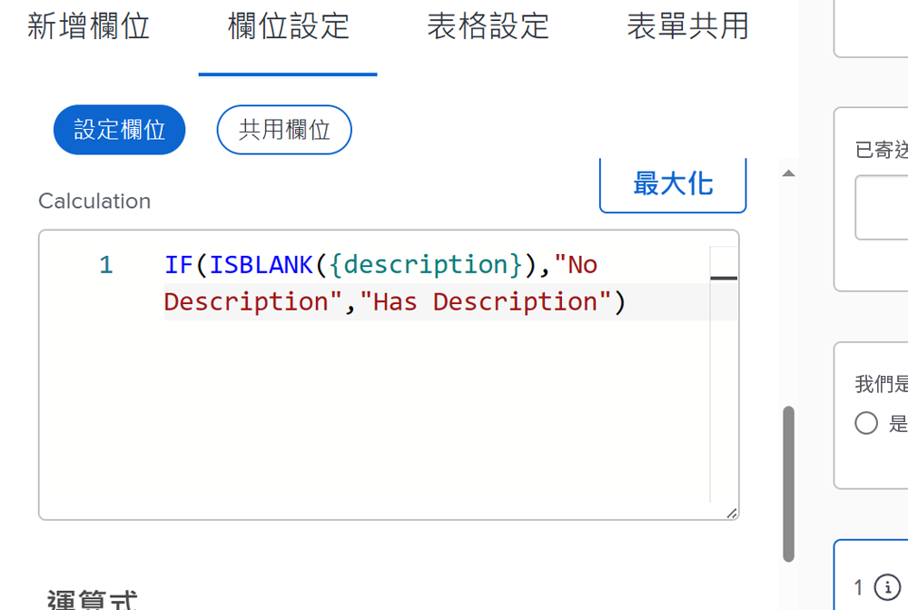
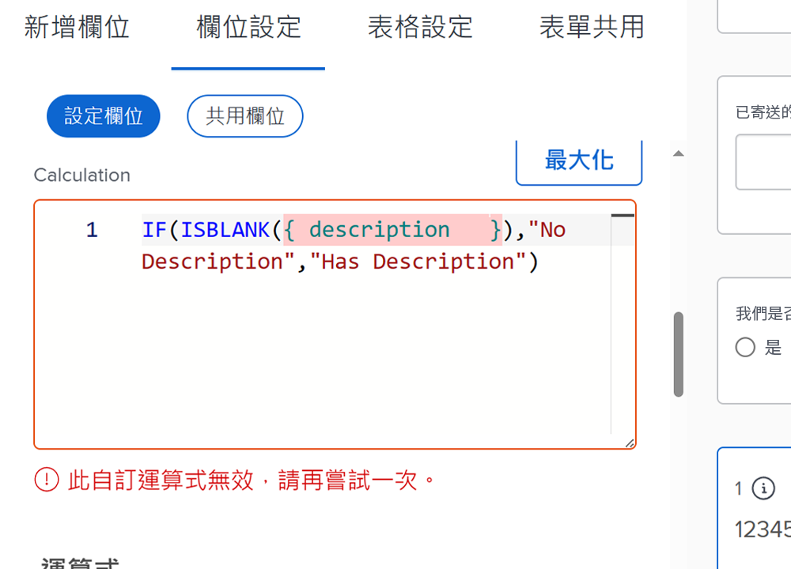
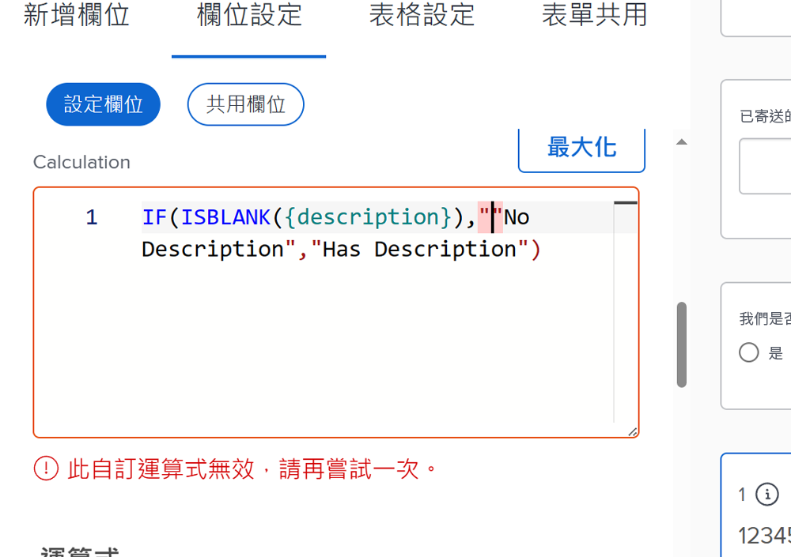
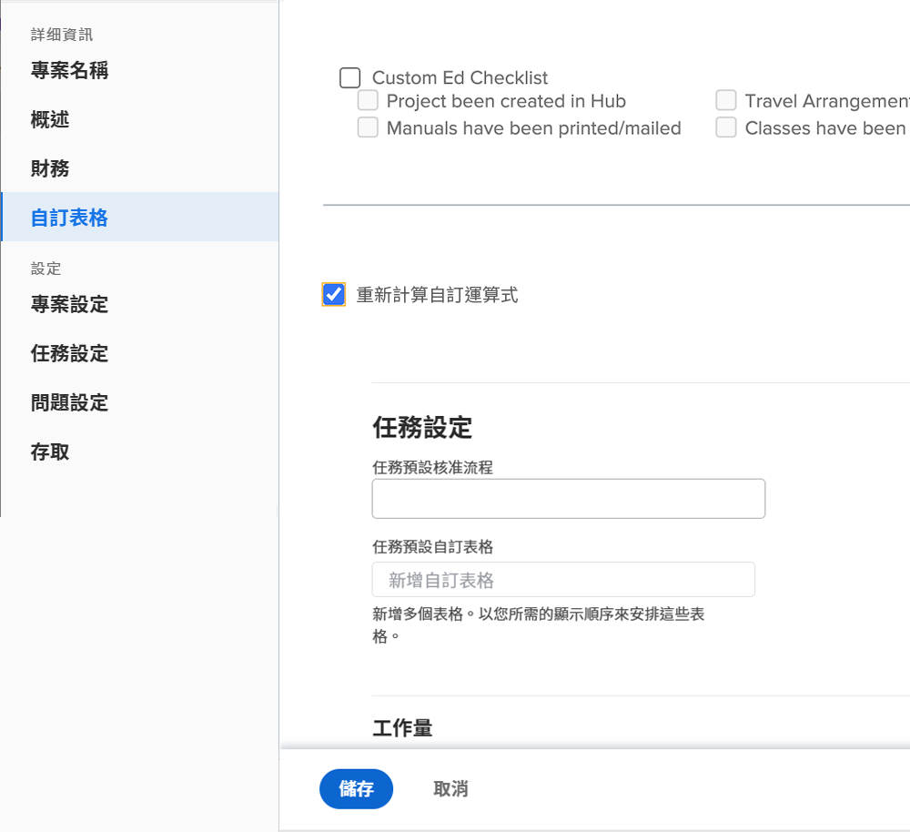

# 計算欄位運算式的須知事項

以下是使用Workfront中的自訂計算欄位時需要瞭解的概念清單。

## 大小寫在運算式名稱中很重要

就運算式名稱而言，大小寫很重要。 一開始撰寫運算式名稱時，您可以使用大寫、小寫或兩者的組合。

不過，運算式必須全部寫入為大寫字母，系統才能識別運算式並儲存欄位。

## 小時以分鐘為單位儲存

Workfront資料庫中的時數會以分鐘為單位儲存。 如果您參考的欄位如計畫時數或實際時數，除以60可顯示時間（以小時而非分鐘為單位）。

## 間距不影響運算式

建議寫入運算式的方式是每個運算式之間只有很小或沒有間距。

* IF(ISBLANK({description})、「沒有說明」、「有說明」)

不過，如果間距可協助您檢視目前的情況，則可新增一些間距至運算式。 額外的空格不應妨礙運算式收集或計算中的值 [!DNL Workfront].

* IF (ISBLANK ({description})、「沒有說明」、「有說明」 )

欄位和大括弧之間不能有空格。 否則，您會收到錯誤訊息，並且無法儲存欄位或自訂表單。

## 引號必須是直的

在運算式中使用引號時，請確定引號是直的(&quot;)。 如果引號是弧形的(&quot;) [!DNL Workfront] 系統將繼續顯示「自訂運算式無效」訊息。

## 表單儲存和物件編輯時的計算更新

這是計算欄位中需要瞭解的重要方面。

除非重新計算自訂表單，否則計算欄位中顯示的資訊將維持不變並過時。

您可以使用物件上「更多」選單中的「重新計算運算式」選項來重新整理運算式。

您想要檢視問題已開啟的天數。 使用運算式DATEDIFF建立名為「開啟天數」的計算欄位。

* 欄位名稱=未結天數
* 運算式= DATEDIFF({entryDate}，$$今天)

儲存後，問題首次建立或在Workfront中輸入的間隔天數，與今天的日期可以顯示在物件的詳細資訊頁面或報告檢視中。

在檢視相同詳細資訊頁面或報表的第二天檢視時，您預期該數字會增加1。 如果今天的數字是5，明天應該是6。 隔天應該是7、8等。

但是，欄位將繼續顯示每天5個。 欄位必須「重新執行」或重新計算才能重新整理資訊。

若要使用「重新計算運算式」選項更新欄位：

* 按一下物件的名稱以開啟它。
* 按一下「更多」功能表。
* 從清單中選取重新計算運算式。

您也可以在清單或報告中使用「大量編輯」功能，同時重新計算多個運算式。 假設您建立了一個報告，其中顯示開啟天數計算出現在欄中的問題清單。 如果您想要一次重新計算所有問題：

* 選取報告中的所有問題。
* 選取編輯選項，以批次編輯所有選取的問題。
* 按一下左側的「自訂Forms」標籤，向下捲動至自訂表單區段。
* 勾選「自訂Forms」區段底部的「重新計算自訂運算式」方塊。
* 按一下「儲存變更」。

畫面會重新整理，以在計算欄位中顯示更新的資訊。

**注意**：雖然有其他方法可更新或重新計算計算計算欄位中的運算式，但這是最快且最簡單的方法。

## 計算可能會因相同欄位中的表單而異

將計算欄位儲存在自訂表單上並儲存自訂表單後，計算欄位就會新增到欄位庫中，以便用於其他自訂表單。

不過，如果您在表單A上有計算欄位，在表單B上有相同的計算欄位，最初的想法是計算完全相同。 情況並非總是如此。 表單A的計算欄位可能在表單B中以完全不同的方式計算。

從欄位庫中選擇計算的自訂欄位並新增到自訂表單時，欄位會新增，但計算為空白。 發生這種情況的一個原因是，計算可能參考了其他物件型別不存在的欄位。

例如，您已建立計算欄位「完成天數」，以判斷完成專案中的任務所需的時間。

* WEEKDAYDIFF({actualStartDate}，{actualCompletionDate})

您想要對反複專案執行相同操作。 您可以使用相同的運算式；但是，工作物件可用的欄位並不總是可用於版序物件。 所以 [!DNL Workfront] 可讓您使用正確的物件欄位來建立計算。

**Pro-Tip**：建立自訂欄位時，將計算運算式從計算方塊複製到指示欄位。 將計算的自訂欄位從欄位資料庫新增到自訂表單時，未清除此欄位。

視需要而定，自訂表單中的計算欄位可能相當簡單或非常複雜。 運算式可以內嵌或巢狀內嵌其他運算式和值，以提供所需的詳細程度來更清楚瞭解組織內正在進行的工作。

<!--Depending on the need, calculated fields in custom forms can be quite simple or very complex. Expressions can embed, or nest, other expressions and values to provide the level of detail needed to get a better picture of what is going on with the work being done at your organization. 

Most of the examples and exercises in this course have been relatively simple to provide a base understanding of the expressions most commonly used and how to build those expressions in a custom calculated field. 

Now you're ready to start building your own calculated custom fields.-->
