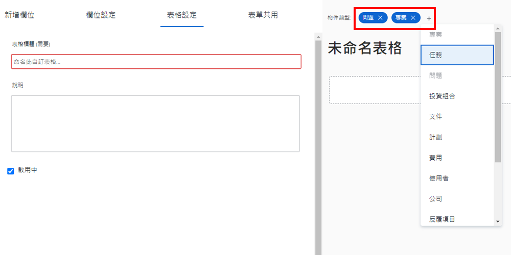

# 建立和共用自訂表單

在本影片中，您將瞭解如何：

* 決定要將哪些物件用於表單
* 以各種格式新增不重複欄位
* 使用區段和邏輯組織欄位
* 與其他使用者共用表單

>[!VIDEO](https://video.tv.adobe.com/v/335172/?quality=12&learn=on)

## 自訂表單可搭配多種物件型別使用

當您按一下 [!UICONTROL 新增自訂表單] 按鈕，您可以選取想要用於單一自訂表單的物件。 當自訂表單附加至所選物件時，您新增至此表單的所有欄位都可供這些物件使用。

![自訂表單視窗顯示 [!UICONTROL 新增自訂表單] 物件選項](assets/create-custom-form.png)

編輯自訂表單時，您可以看到所有選取的物件型別。 您可以在此清單中新增或刪除物件型別。

您可能會想要建立專案和問題型別的自訂表單。 附加到問題時，您可以填寫與問題相關的任何欄位。 稍後，如果您決定將問題轉換為專案，自訂表單將自動載入專案，您在問題自訂表單欄位中輸入的資料將可用於在專案自訂表單中檢視或編輯。

## 自訂欄位選項

**[!UICONTROL 標籤] 和 [!UICONTROL 名稱] 欄位**

此 [!UICONTROL 標籤] 和 [!UICONTROL 名稱] 自訂欄位上的欄位有不同的用途。 [!UICONTROL 標籤] 是使用者看到的欄位名稱 [!DNL Workfront]. [!UICONTROL 名稱] 是可與整合搭配使用的功能，例如API。

![自訂表單視窗顯示 [!UICONTROL 標籤] 和 [!UICONTROL 名稱] 欄位](assets/custom-forms-field-label-and-name.png)

這可提供彈性來變更使用者導向標籤，以符合組織中的變更，而不會影響依賴特定欄位名稱的整合或其他連線。

**[!UICONTROL 含格式的文字欄位]**

此 [!UICONTROL 含格式的文字欄位]包含基本文字標籤工具，可讓使用者在自訂表單的欄位中填寫文字時，在文字上新增粗體、斜體或底線。

![自訂表單視窗顯示 [!UICONTROL 含格式的文字欄位] option](assets/custom-forms-text-field-with-formatting.png)

欄位也有15,000個字元的限制，可留出大量空間提供重要資訊，並使用格式設定讓其他人輕鬆閱讀。

**[!UICONTROL 自動提示] 欄位**

此 [!UICONTROL 自動提示] 欄位可讓系統根據為欄位選取的物件自動填入選項清單。

![自訂表單視窗顯示 [!UICONTROL 自動提示] 欄位選項](assets/custom-forms-typeahead-1.png)

例如，如果您建立 [!UICONTROL 自動提示] 名為「行銷經理核准名稱」的欄位，然後選取 [!UICONTROL 使用者] 作為參照物件型別，當使用者在自訂表單上填寫該欄位時，會出現使用者名稱清單。 此 [!UICONTROL 自動提示] 欄位的用途是將您的自訂資料與系統中擷取的資訊連線起來，而無需在下拉欄位中手動維護許多選項。

![自訂表單視窗顯示 [!UICONTROL 自動提示] 下拉式功能表](assets/custom-forms-typeahead-2.png)
