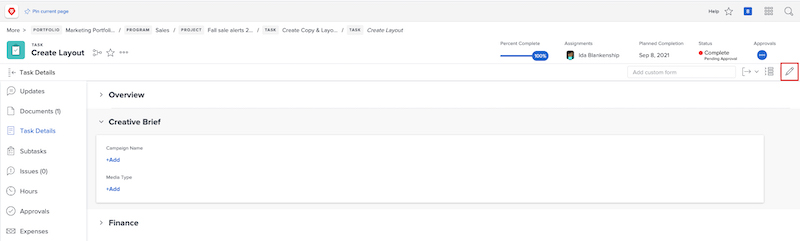

# 編輯自訂表單

<!---
21.4 updates have been made here
--->

表單附加至物件後，您就可以編輯自訂表單的資訊。

1. 導覽至您要編輯自訂表單資訊的物件。
1. 按一下 [物件類型] **[!UICONTROL 詳細資料]** 中。
1. 按一下自訂表單名稱旁的箭頭，展開自訂表單。
1. 按一下自訂表單中的單一欄位，即可進入該欄位的編輯模式。 您也可以按一下 [!UICONTROL 編輯] 圖示來編輯所有自訂表單或編輯自訂表單的區段。
1. 在單一自訂欄位中輸入資訊，即使物件上其他自訂表單的必要欄位尚未填寫亦然。
1. 按一下 **[!UICONTROL 儲存變更]**.

