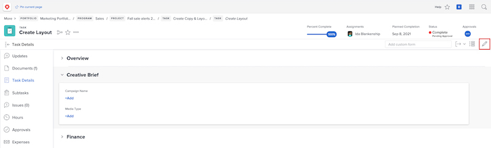

# 編輯自訂表單

<!--
21.4 updates have been made here
-->

在自訂表單附加到物件上之後，您可以編輯表單上的資訊。

1. 導覽到您要在自訂表單上編輯資訊的物件。
1. 在左側面板按一下「[物件類型]**[!UICONTROL 詳細資料]**」。
1. 按一下自訂表單名稱旁邊的箭頭來展開表單。
1. 按一下自訂表單中的單一欄位，讓該欄位進入編輯模式。 您也可以按一下右上角的「[!UICONTROL 編輯]」圖示來編輯所有自訂表單或編輯自訂表單的選定部分。
1. 在單一自訂欄位中輸入資訊，即使在物件上其他自訂表單中的必要欄位尚未填入。
1. 按一下「**[!UICONTROL 儲存變更]**」。

