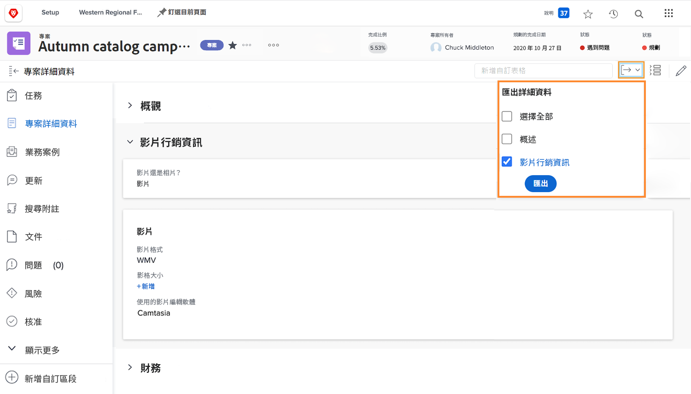

# 將自訂表單匯出為PDF

擷取組織的獨特資料是工作管理的重要部分。 自訂表單通常用於此目的。 能夠匯出自訂表格可讓使用者輕鬆傳閱和共用表格。 當您存取中的表單時，可以從專案、任務或問題匯出自訂表單 [!UICONTROL 詳細資料] 物件的區段。

您也可以包含 [!UICONTROL 概觀] 匯出PDF中的區域。

例如，若要匯出附加至專案的名為「視訊行銷資訊」的自訂表單：

1. 按一下 **[!UICONTROL 匯出]** 圖示。 所有附加到專案的自訂表單都會出現在下拉式功能表中，包括 [!UICONTROL 概觀] 區段。
1. 從清單中選取「視訊行銷資訊」。
1. 按一下 **[!UICONTROL 匯出]** 位於清單底部。

已下載格式化的PDF檔案。

