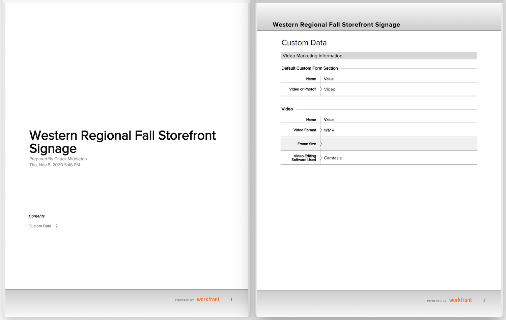

# 將自訂表單匯出為PDF

擷取組織的獨特資料是工作管理的重要部分。 自訂表單通常用於此用途。 能夠匯出自訂表單，便於散發和分享。 在下列位置存取表單時，您可以從專案、工作或問題匯出自訂表單： [!UICONTROL 詳細資料] 對象的部分。

您也可以包含 [!UICONTROL 概述] 區域。

例如，若要匯出附加至專案的自訂表單，名為「視訊行銷資訊」：

1. 按一下 **[!UICONTROL 匯出]** 表徵圖。 附加至專案的所有自訂表單都會顯示在下拉式功能表中，包括 [!UICONTROL 概述] 區段。
1. 從清單中選取視訊行銷資訊。
1. 按一下 **[!UICONTROL 匯出]** 在清單的底部。

下載格式化PDF檔案。

