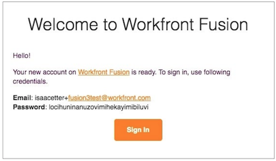

# 以新使用者身分登入

當您受邀作為Workfront Fusion執行個體的新使用者時，您會收到兩封電子郵件。

有一封電子郵件在Workfront Fusion系統管理員建立您的設定檔並邀請您加入組織時新增了備註。 電子郵件底部為 [!UICONTROL 接受角色] 按鈕。 **不要再按這個按鈕！**

另一封電子郵件則包含您的登入認證。

若要開始使用Workfront Fusion，請按一下 [!UICONTROL 登入] 按鈕，並使用提供的密碼登入。

第一次登入後，系統會提示您變更密碼。

登入後，請返回另一封電子郵件並按一下 [!UICONTROL 接受角色] 按鈕。

執行此操作後，請返回Workfront Fusion並重新整理頁面。 您現在可以在左側面板中看到您的團隊和概觀區段。
