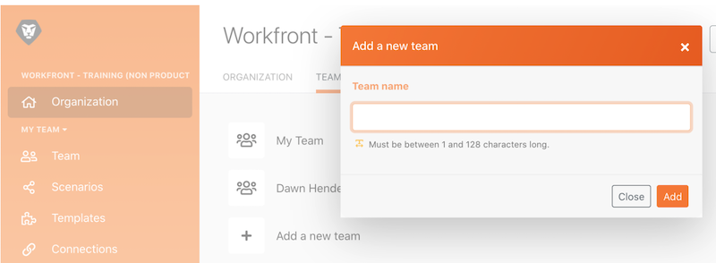

# 管理操作示範

瞭解如何在不同的組織或團隊之間切換，以及新增使用者到系統中。

## 管理操作示範

觀看這段影片，您將會瞭解：

* 如何在組織和團隊之間進行導覽
* 如何建立團隊
* 如何邀請使用者加入一個組織和團隊

>[!VIDEO](https://video.tv.adobe.com/v/335310/?quality=12&learn=on&enablevpops=1)

>[!NOTE]
>
>如果您的組織已加入 Adobe Admin Console，請參閱[透過 Adobe Admin Console 將使用者新增至 Adobe Workfront Fusion](https://experienceleague.adobe.com/docs/workfront/using/adobe-workfront-fusion/fusion-in-experience-cloud/add-fusion-users-admin-console.html?lang=zh-Hant)。

## 想要瞭解更多嗎？ 我們建議參閱以下資訊：

[Workfront Fusion 文件](https://experienceleague.adobe.com/zh-hant/docs/workfront-fusion/using/get-started-with-fusion/understand-workfront-fusion/workfront-fusion-overview)
