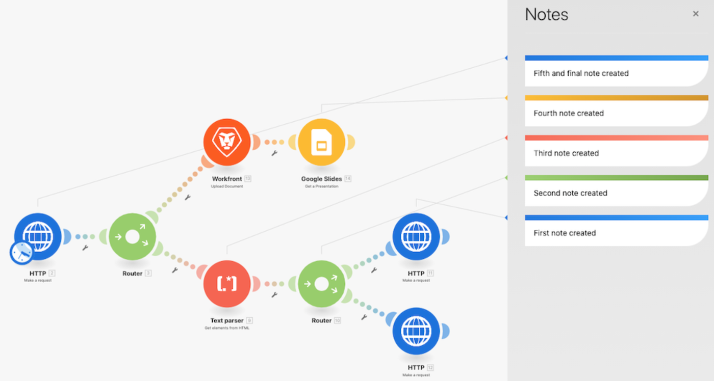

# 無障礙與清晰度

在Workfront Fusion培訓初期，您就學到了一些基本的最佳做法，使情境易於閱讀、共用和理解。 這些做法可讓未來的Workfront Fusion使用者或任何疑難排解或支援您的Workfront Fusion執行個體的人員，更輕鬆。 在設計方案時，請遵循以下指引向前支付。

## 標籤和附註

一般而言，Workfront Fusion的主要目標一律是擁有簡單的情境設計。 以下提供一些可簡單解讀的設計。

* 請務必為所有模組命名。 以滑鼠右鍵按一下模組，然後選取重新命名。 模組標籤應簡短但可清楚了解模組的執行情形。 例如「使用Ch範本建立Mktg Proj」。
   
* 標籤路由路徑。 即使路徑在路由器後不直接使用過濾器，也可以應用標籤，而不需要填寫過濾器邏輯。 這麼做可讓其他人了解哪些套件組合會傳遞哪些路徑及原因。 要為沒有篩選器的路由器路徑建立標籤，請按一下右鍵該路徑，添加標籤並保存。
   
* 如果模組標籤或路由路徑標籤太短，無法釐清實際發生的情況，請在適用的情況下新增附註。 您可以在整個設計和迭代過程中根據需要添加註釋。

不過，如果您在準備好啟動時，在案例設計的最後添加附註，您最容易閱讀並了解。 從案例設計的結尾（最下方、右角）向後工作。 這樣，在開啟附註面板時，套用至案例開頭的附註就會位於清單頂端。

儲存或關閉附註面板後，附註會以最近建立的頂端排序。 在下圖中，建立的第一個注釋出現在清單的底部。 注釋是刻意從右下角建立到上面的路徑，最後到觸發器 — 實際上是資料組通過情境的反向順序。 這樣，便會以案例實際對資料組合執行的順序顯示附註。

## Workfront Fusion模板

簡化模組和路由路徑標籤的一個絕佳方法是使用模板。 最佳實務範本可加速建立常見使用案例的情境。

### 範本範例

開始案例時，請先檢查是否有可用的範本可提供協助。 例如，您想要建立從Workfront下載CSV檔案開始的案例，然後加以剖析。

按一下「範本」區段，查看是否有任何公開範本符合您的需求。

按一下「團隊模板」(Team Templates)頁簽，查看您的團隊中是否有人建立了可能有用的模板。

如果您找到要使用的範本，請按一下名稱以開啟。

然後前往右上角，按一下「選項」，然後選取「建立」藍本。

### 建立範本

您可以在「團隊範本」區段中建立範本。 您和您的團隊可以使用您建立的範本，但按一下「發佈」按鈕時，您可以與團隊外部的人員共用該範本。

建置範本時，您可以加入精靈，引導使用範本的人員建立其案例、變更連線、對應資料，以及視情況使用其他面板欄位。

勾選「在精靈中使用」核取方塊，新增當使用您的範本建立案例時可用的指示。 此資訊將顯示在「幫助」欄位中。 若要在使用範本時讓使用者看到此文字，請啟用「使用」作為預設值。

## 想要進一步了解嗎？ 我們建議下列項目：

[Workfront Fusion檔案](https://experienceleague.adobe.com/docs/workfront/using/adobe-workfront-fusion/workfront-fusion-2.html?lang=en)
