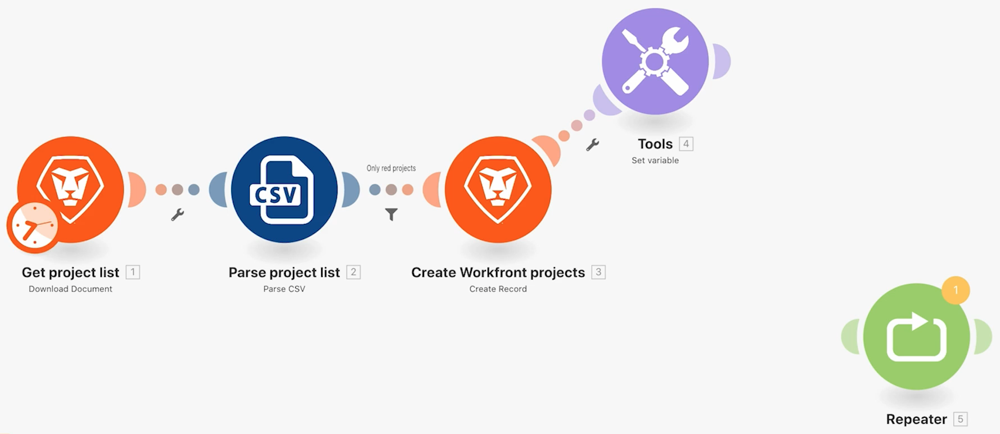

# 存取之前版本練習

了解如何返回前一版本的情境。

## 練習概觀

探索在您已經變更情境設定並且儲存數次之後，如何還原前一版本的情境。

## 執行步驟

1. 原地複製您的「使用功能強大的篩選器」情境並命名為「存取之前版本」。
1. 在「建立 Workfront 專案」模組之後新增「Set 變數」模組。 將變數命名為「測試」。
1. 將其拖曳到新位置並儲存情境。

   

1. 新增一個「重複執行」模組，取消與之前模組的連結，然後再次儲存情境。

   

1. 現在刪除所有模組並儲存。
1. 在工具列中，按一下三圓點選單並按一下「之前版本」選項。 選項清單顯示所儲存的每個版本之日期和時間戳記。

   

1. 選取之前版本並注意設計工具中的情境如何回到您的儲存位置。
