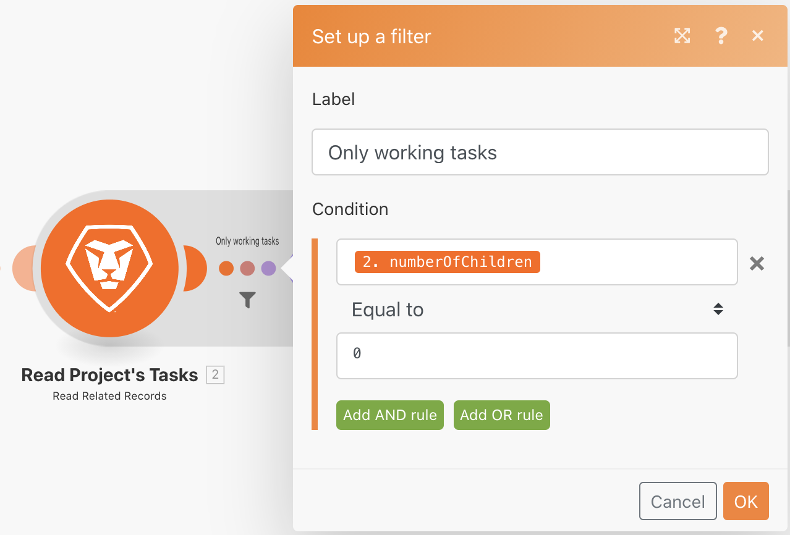

# 匯總

了解如何將多個資訊套件組合為單一值。

## 練習概觀

使用您在上次練習中建立的「迭代簡介」案例，匯總專案中每個工作任務的計畫時數，並傳送電子郵件給您自己，內含該資訊。

## 遵循步驟

**新增篩選並加總計畫小時數。**

1. 原地複製您在上次練習中建立的「迭代簡介」案例，並將其命名為「匯總簡介」。
1. 在讀取項目的任務模組和計算任務數模組之間添加篩選器。 將篩選器命名為「僅工作任務」。
1. 將條件設定為子項數 [數值運算子：等於] 0。

   

1. 在隨機數學模組之後，新增數值匯總工具模組。
1. 將源模組設定為讀取項目的任務。
1. 將匯總函式設定為SUM。
1. 從讀取項目的任務模組將值設定為工作欄位。
1. 將此模組更名為「所有任務計畫小時數的總和」。

   

   **請注意顯示聚合結束小版本的陰影。**

   

   **傳送包含匯總小時數的電子郵件。**

1. 在數值匯總器後面，新增從電子郵件應用程式傳送電子郵件模組。
1. 將電子郵件傳送給您自己。
1. 主旨行是「專案詳細資料」。
1. 在「內容」欄位中，放置「有一個專案，稱為 [專案名稱] 總數 [結果] 計畫小時數。」 「[專案名稱]」取自「讀取記錄」模組和「[結果]」會從匯總模組擷取。

   

1. 儲存並執行一次。 在收件匣中找到電子郵件。

在小版本中，可以訪問各個包。 但在小版本之外，在「傳送電子郵件」模組中，只能存取匯總欄位。
