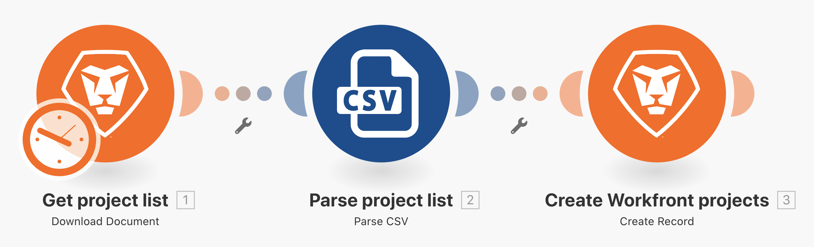

# 超越基本對應練習

了解如何使用對應面板公式來操控或轉換傳送到模組的欄位。

## 練習概觀

使用對應面板公式來變更「超越基本對應」操作示範練習中的專案名稱、規劃開始日期和優先順序。

## 執行步驟

**原地複製您的初始情境設計情境。**

1. 在情境區段中，選取初始情境設計右邊的「原地複製」選項，如下所示：將其命名為「超越基本對應」。

   

   **我們現在將使用「建立 Workfront 專案」模組中的對應面板來設定專案名稱、規劃開始日期和優先順序欄位。**

1. 按一下「建立 Workfront 專案」模組來編輯設定。使用對應面板，把「名稱」欄位變更為「[我的專案名稱]，依[發起人]」。

   + 「[我的專案名稱]」是來自剖析 CSV 模組的第 1 欄，而「[發起人]」是第 6 欄。在兩者之間輸入字詞「依」。

1. 接著前往「規劃開始日期」並使用「addDays」公式讓欄位增加 15 天，如「超越基本對應」操作示範影片所述。
1. 找到「優先順序」欄位並切換欄位右上角的「對應」按鈕。選項清單的選單變更為數字。如果 CSV 檔案的信賴等級小於 100，請建立 IF 陳述式把專案標記為「高 (4)」優先順序，否則的話它會是「一般 (2)」。

   + 第 4 欄的信賴等級。

   **此時，您的對應面板應如下所示：**

   

1. 按一下「確定」並再按一下「執行一次」。
1. 在您的 Workfront 執行個體中找到該專案，以確保所有內容均正確對應。
1. 儲存您的情境。
