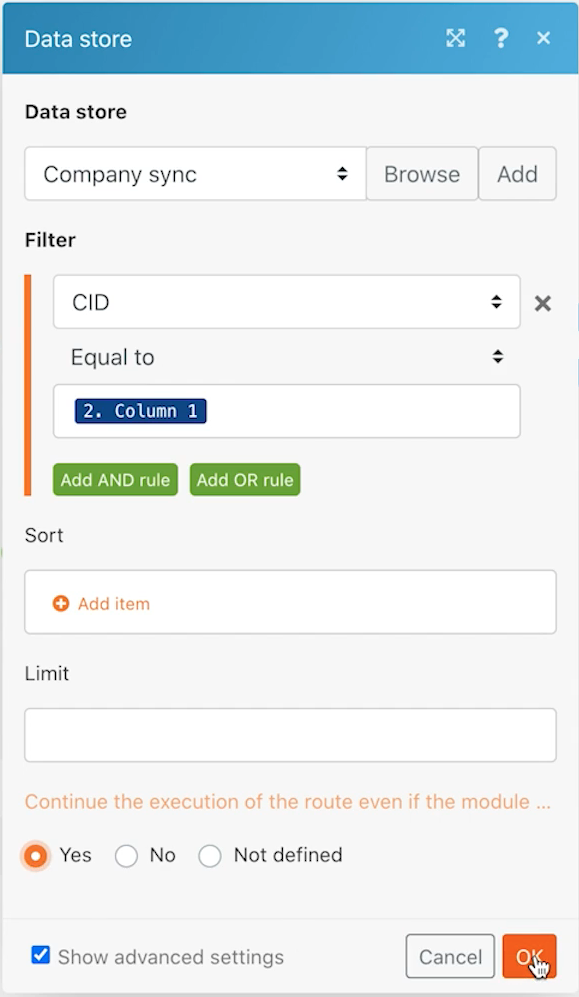
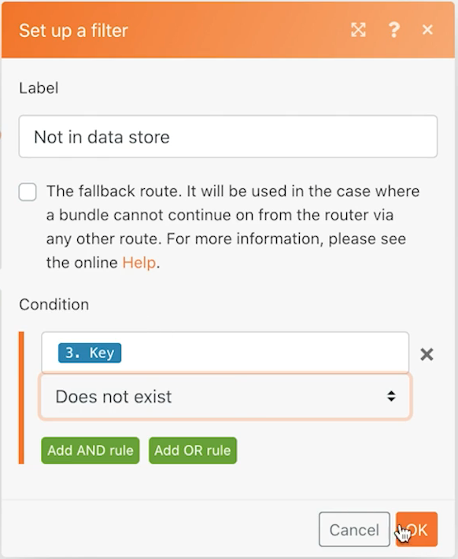

# 資料儲存練習

瞭解如何讓兩個系統之間的公司名稱同步。

## 練習概觀

這是 Workfront 和另一個系統中多家公司進行單向同步的第一部分。目前只會在 Fusion 資料儲存區與 Workfront 之間進行同步。資料儲存區中有一個表格追蹤記錄 Workfront ID (WFID) 以及每家公司以 CSV 檔案儲存的公司 ID (CID)。在未來某個時間點可以利用此表格進行雙向同步。

## 執行步驟

**從 Workfront 下載檔案。**

1. 在 Workfront「Fusion Exercise Files」資料夾中，選取「_Companies.csv」並按一下「文件詳細資料」。
1. 複製 URL 網址中第一個 ID 號碼。
1. 在 Fusion 中，建立一個名為「使用資料儲存區來同步資料」的情境。
1. 觸發模組請選取「Workfront 下載文件」模組。
1. 設定 Workfront 連線並包含從 Workfront URL 複製而來的文件 ID。
1. 將這個模組命名為「取得公司檔案」。
1. 現在新增一個剖析 CSV 模組。
1. 在「欄數量」欄位輸入「2」。
1. 把取自「下載文件」模組的資料對應到「CSV」欄位。
1. 將這個模組命名為「剖析公司檔案」。
1. 請儲存您的情境並按一下「執行一次」。

   **建立資料儲存區和資料結構。**

1. 新增資料儲存區搜尋記錄模組。
1. 建立一個名為「公司同步」的新資料儲存區。
1. 在資料儲存區中，建立名為「公司同步 (結構)」的資料結構。
1. 建立四個欄位。

   + CID - CSV 檔案中的公司 ID
   + 公司名稱
   + WFID - Workfront 公司 ID
   + 建立日期 - 確認資料類型是日期

   

1. 在資料結構上按一下「儲存」，接著把資料儲存大小設為「1」並儲存資料儲存區。
1. 在資料儲存區模組中繼續執行，設定一個篩選器，其中 CID 等於剖析 CSV 模組 (欄 1) 中的公司 ID。
1. 按一下「顯示進階」設定並選取選項「繼續執行情境或路由，即使這個模組未回傳任何結果」。

   

1. 將模組重新命名為「相符的公司」。
1. 新增 Workfront 搜尋記錄模組。
1. 記錄類型請選取「公司」。
1. 搜尋條件是 Workfront 內公司名稱等於 CSV 檔案內公司名稱。
1. 輸出設定請選取公司名稱和 ID。

   

1. 按一下「確定」並把這個模組重新命名為「相符的公司」。

   **根據公司存在於 Workfront 或資料儲存區來建立不同的路徑。**

   **路由路徑 1 - 建立一家公司。**

1. 在 Workfront 搜尋記錄模組的右側新增一個路由器模組。
1. 將 Workfront 建立記錄模組新增到頂部路徑。
1. 將記錄類型設定為「公司」。
1. 從欄位選取要對應的名稱。將名稱欄位對應到剖析 CSV 模組 (欄 2) 的輸出。
1. 將這個模組重新命名為「建立公司」。

   

1. 在路由器之後新增篩選器，唯有 Workfront 中尚未有該家公司時才建立一個公司。將其命名為「不在 Workfront 中」。
1. 把「狀況」設為來自 Workfront 搜尋模組的 ID 以及「不存在」。

   

   **準備在下一個路徑中更新資料儲存區。**

1. 在頂部路徑的末端新增一個「Set 變數」模組。
1. 把變數名稱設為「Workfront ID」。
1. 把變數值設定為取自「建立公司」模組的 ID。
1. 把這個模組重新命名為「設定 Workfront ID」。

   **路由路徑 2 - 更新資料儲存區。**

1. 在路由路徑 2 建立篩選器。將其命名為「不在資料儲存區」。

1. 把「狀況」設為來自資料儲存區模組的索引鍵以及「不存在」。

   

1. 這個路徑的第一個模組是 Get 變數模組。
1. 把變數名稱設為「Workfront ID」。
1. 把這個模組重新命名為「取得 Workfront ID」。
1. 新增另一個來自資料儲存區應用程式的模組：新增/取代一筆記錄。
1. 在資料儲存欄位中選擇「公司同步」。這是您稍早前建立的資料儲存區。
1. 把「索引鍵」欄位留白。
1. 對應剖析 CSV 模組中欄 1 的 CID 欄位。
1. 對應剖析 CSV 模組中欄 2 的公司名稱欄位。
1. 對應取自 Get Workfront ID 模組的 WFID 欄位。
1. 「建立日期」欄位請使用「日期與時間」標籤的「formatDate」函式，用「月/日/年」的格式顯示目前日期。

   

1. 按一下「確定」並把這個模組重新命名為「建立公司條目」。

   **路由路徑 3 - 將系統之間的資料儲存區同步。**

1. 首先在路由路徑 3 建立一個篩選器。將其命名為「公司存在但不在資料儲存區」。
1. 把「條件」設為來自資料儲存區搜尋記錄模組的索引鍵以及「不存在」。
1. 按一下「新增 AND 規則」按鈕並指定來自 CSV 檔案 (欄 2) 的公司名稱等於在 Workfront 搜尋模組中找到的公司名稱。

   

1. 現在原地複製路由路徑 2 末端的模組來新增另一個「新增/取代一筆記錄」模組。
1. 拖曳原地複製的模組到路由路徑 3 末端的位置。刪除原本位在那裡的空白模組。
1. 按一下原地複製的模組。所有欄位應維持不變，但 WFID 欄位除外。從「相符的公司」搜尋模組中把資料對應出來。

   

1. 按一下「確定」並把這個模組重新命名為「建立公司條目」。
