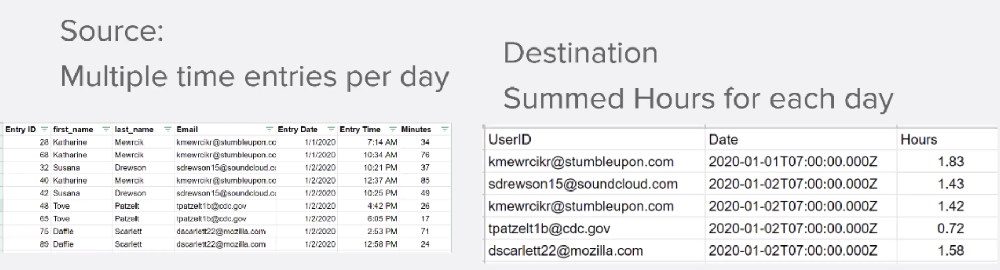

# 資料結構

將資料從源檔案轉換為目標檔案。

## 練習概觀

開啟包含時間項目清單的CSV檔案。 這些時間項目是多位使用者在特定日期記錄的分鐘數。 目標是取用這項資訊並產生新的CSV，以小時為單位顯示每位使用者每天記錄的總時間。

在此案例中，您將開啟一個檔案，其中包含工作分鐘數的時間項目清單，包括日期和時間、輸入的分鐘數，以及輸入者的電子郵件地址。 有100個時間條目，有些是由同一個人做的，有些是在同一天做的。

若要產生一個檔案，顯示每個人每天的總工作時間（以小時為單位），您將遵循下列步驟：

1. 在觸發程式模組中，從Workfront資料夾取得檔案。 下載檔案。
1. 在第一個CSV模組中，剖析時間項目資料以針對每次項目輸出一個套件組合。 這是迭代器。
1. 第一個工具模組是數值匯總器。 這會依電子郵件地址，然後依日期加總所有分鐘數並將列分組。 結果就是每天按電子郵件地址工作的總分鐘數。
1. 第二個工具模組是設定變數模組。 使用此格式將分鐘數除以60，然後四捨五入到2個小數。
1. 在第二個CSV模組中，設定輸出檔案。
1. 在最終模組中，將CSV檔案上傳至Workfront。

## 遵循步驟

**從Workfront下載檔案。**

1. 在Workfront的「Fusion Exercise Files」資料夾中，選擇「_Fusion1.0JanTime.csv」，然後按一下「Document Details」。
1. 從URL位址複製第一個ID號碼。
1. 建立新藍本。 將其命名為「建立和使用資料結構」。
1. 從Workfront應用程式的下載檔案模組開始。
1. 設定您的Workfront連線，並加入您從Workfront URL複製的檔案ID。

   

   **分析時間條目資料。**

1. 新增其他模組，選取「剖析CSV」。
1. 設定7欄的剖析CSV。 勾選「CSV包含標題」方塊。 選擇逗號分隔字元類型，並將資料放入CSV欄位中。

   

1. 按一下「執行一次」以檢視輸出。
1. 開啟執行檢查器，查看Parse CSV模組的輸入和輸出。 有一個套件組合（CSV檔案）作為輸入，而數個套件組合作為輸出（CSV檔案中每一列各一個套件組合）。 看起來應該像這樣：

   

   **接下來，將資料轉換為所需的輸出表單，匯總的時間總計以小時表示，而非以分鐘錶示。**

1. 新增數值匯總工具模組。
1. 選取來源模組，即「剖析CSV」模組。
1. 為聚合函式選擇SUM。
1. 「值」欄位是CSV檔案中的第7欄。 這是每位使用者記錄的分鐘數。
1. 若要依群組加總欄位，請按一下「進階設定」並設定「依」 ，將欄位設為電子郵件（欄4）、日期（欄5）。

   + 這會加總電子郵件與日期的每個組合。 請務必在第4欄和第5欄之間放置逗號。 稍後將以此分隔字元的形式使用。

   **您的對應面板應如下所示：**

   

1. 按一下「運行一次」以檢查聚合輸出。

   **輸出套件組合應如下所示：**

   

   **現在將匯總的分鐘數轉換為小時。**

1. 添加其他工具模組，選擇設定變數。
1. 將變數命名為「小時」。
1. 將變數值設為formatNumber(result/60;2;。;,)

   **您的對應面板應如下所示：**

   

   **接下來，為輸出檔案設定值。 您想要將userID和日期值用於群組。 您也想要計算的小時數。**

1. 使用匯總器建立CSV（進階）新增另一個模組 — CSV模組。
1. 來源模組是「工具 — 數值匯總器」。
1. 按一下「資料結構」欄位中的「新增」，並將我們的資料結構命名為「每日記錄總和時間」。
1. 按一下「新增項目」以建立第一個項目。
1. 將項目命名為「UserID」，並將類型設為「Text」。 按一下「新增」 。
1. 再按一下「新增項目」以建立第二個項目。
1. 將項目命名為「Date」，將類型設定為「Date」，然後按一下「Add」。
1. 再按一下「新增項目」。
1. 將項目命名為「小時」，將類型設定為「編號」，然後按一下「添加」。

   **您的資料結構應如下所示：**

   

1. 按一下「儲存」以完成「每日記錄時間總和」資料結構。

   **現在，您會提供剛建立之三個欄位的值。 您應會在CSV對應面板中看到這三個欄位。**

1. 按一下UserID欄位中的，然後從一般函式索引標籤中選擇GET。 在第一個參數中，從「文本和二進位函式」頁簽中放置SPLIT。 SPLIT函式的第一個參數是「鍵」欄位。 新增逗號作為分隔字元，並新增1作為索引。 這表示您希望GET擷取金鑰陣列中的第一個欄位。
1. 將此運算式複製到「日期」欄位。 將索引從1變更為2，以GET陣列中的第二個值。
1. 對於「小時」欄位，從「設定變數」工具中添加「小時」欄位。

   **您的CSV對應面板應如下所示：**

   

   **如果您現在執行案例，應會看到此輸出：**

   

   **現在，新增模組以取得此輸出，並將其以檔案形式上傳至Workfront中的現有專案。**

1. 在Workfront中開啟專案，並從URL複製專案ID。
1. 返回Fusion中的案例，並從Workfront應用程式新增另一個模組 — 上傳檔案模組。
1. 將專案ID貼入「相關記錄ID」欄位。
1. 為相關記錄類型選擇項目。
1. 為源檔案選擇映射選項。
1. 對於「文檔名」，使用您下載的檔案名，在前面添加「已更新」。
1. 對於「檔案」內容，請使用「建立CSV」模組的「文字」輸出。

   **您的對應面板應如下所示：**

   

1. 按一下「確定」 ，然後「儲存藍本」 。
1. 按一下「執行一次」以執行案例。

   **檢查「上載文檔」模組中的執行檢查器，以確認已上載文檔。**

   
