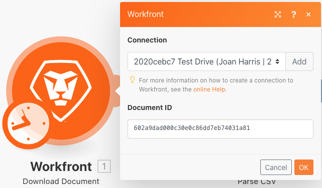
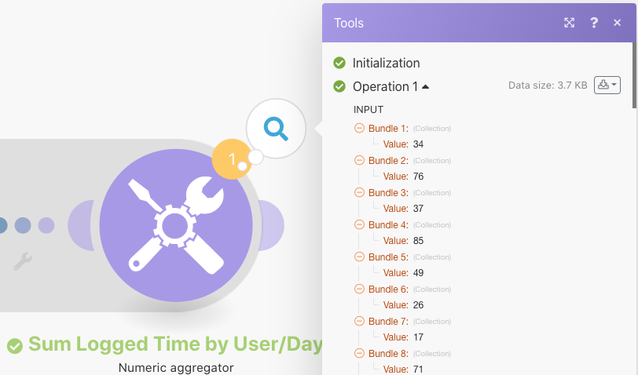

# 資料結構

將來源檔案中的資料轉換為目的地檔案。

## 練習概述

開啟包含時間專案清單的CSV檔案。 這些時間專案代表多個使用者在某些天內記錄的分鐘數。 目標是要利用此資訊並產生一個新的CSV，以顯示每位使用者每天記錄的總時間（以小時為單位）。

在此案例中，您將開啟一個檔案，其中包含工作分鐘數的時間專案清單，包括日期和時間、輸入的分鐘數以及輸入者的電子郵件地址。 共有100個時間專案，有些是由相同的個人所產生，有些是在與其他人相同的日期產生。

若要產生檔案來顯示每人每天的總工作時間（小時），請依照下列步驟進行：

1. 在觸發程式模組中，從Workfront資料夾中取得檔案。 下載檔案。
1. 在第一個CSV模組中，剖析時間專案資料以針對每個時間專案輸出一個套件。 這是一個迭代器。
1. 第一個「工具」模組是數值彙總。 這會加總所有分鐘數，並依電子郵件地址、然後依日期將列分組。 結果就是電子郵件地址的每日總工作分鐘數。
1. 第二個工具模組是設定變數模組。 使用這個來格式化要除以60的分鐘並四捨五入為2個小數。
1. 在第二個CSV模組中，設定輸出檔案。
1. 在最後一個模組中，將CSV檔案上傳至Workfront。

## 要遵循的步驟

**從Workfront下載檔案。**

1. 在Workfront「Fusion Experience Files」資料夾中，選取「_Fusion1.0JanTime.csv」並按一下「檔案詳細資訊」。
1. 從URL位址複製第一個ID號碼。
1. 建立新情境。 將其命名為「建立和使用資料結構」。
1. 從Workfront應用程式的「下載檔案」模組開始。
1. 設定您的Workfront連線，並包含您從Workfront URL複製的檔案ID。

   

   **剖析時間專案資料。**

1. 新增另一個模組，選取「剖析CSV」。
1. 為7欄設定剖析CSV 。 勾選「CSV包含標題」方塊。 選擇逗號分隔符號型別，並將資料放入CSV欄位中。

   

1. 按一下「執行一次」以檢視輸出。
1. 開啟執行檢查器以檢視「剖析CSV 」模組的輸入和輸出。 有一個套件（CSV檔案）作為輸入，多個套件作為輸出（CSV檔案中的每一列有一個套件）。 它應該看起來像這樣：

   

   **接下來，將資料轉換為所需的輸出表單，彙總時間總計以小時而非分鐘表示。**

1. 新增數值彙總工具模組。
1. 選取來源模組，即剖析CSV模組。
1. 選取彙總函式的SUM。
1. 「值」欄位是CSV檔案中的第7欄。 這是每個使用者記錄的分鐘數。
1. 若要依群組來加總欄位，請按一下「進階設定」，並將「群組依據」設定為電子郵件（欄4）、日期（欄5）。

   + 這會對電子郵件和日期的每種組合進行加總。 請務必在欄4和欄5之間加上逗號。 這稍後將用作分隔字元。

   **您的對應面板應如下所示：**

   

1. 按一下「執行一次」以檢查彙總輸出。

   **輸出套件組合看起來應該像這樣：**

   

   **現在將彙總分鐘數轉換為小時數。**

1. 新增另一個工具模組，選取「設定變數」。
1. 將變數命名為「小時」。
1. 將變數值設為formatNumber(result/60；2；。；，)

   **您的對應面板應如下所示：**

   

   **接下來，取得為輸出檔案設定的值。 您想要將使用者ID和日期值用於群組。 您還需要計算的時數。**

1. 使用彙總器建立CSV （進階）新增另一個模組 — CSV模組。
1. 來源模組是「工具 — 數值彙總」。
1. 按一下資料結構欄位的新增，並將我們的資料結構命名為「Time Logged Daily Sum」。
1. 按一下「新增專案」以建立第一個專案。
1. 將專案命名為「UserID」，並將型別設定為「文字」。 按一下「新增」。
1. 再按一下「新增專案」來建立第二個專案。
1. 將專案命名為「日期」，將型別設定為「日期」，然後按一下「新增」。
1. 再按一次「新增專案」。
1. 將專案命名為「小時」，將型別設定為「數字」，然後按一下「新增」。

   **您的資料結構應如下所示：**

   

1. 按一下儲存，即可完成「每日記錄時間」加總資料結構。

   **現在提供您剛建立之三個欄位的值。 您應該會在CSV對應面板中看到這三個欄位。**

1. 按一下UserID欄位中的，然後從一般函式標籤中選擇GET。 在第一個引數中，從文字和二進位函式索引標籤中放置SPLIT。 SPLIT函式的第一個引數是Key欄位。 新增逗號作為分隔符號，1作為索引。 這表示您希望GET擷取索引鍵陣列中的第一個欄位。
1. 將此運算式複製到「日期」欄位。 將索引從1變更為2，以GET陣列中的第二個值。
1. 在「小時」欄位中，從「設定變數」工具新增「小時」欄位。

   **您的CSV對應面板應如下所示：**

   

   **如果您現在執行案例，您應該會看到此輸出：**

   

   **現在，新增模組以取得此輸出，並將其作為檔案上傳到Workfront中的現有專案。**

1. 在Workfront中開啟專案，並從URL複製專案ID。
1. 返回Fusion中的情境，並新增另一個模組，即Workfront應用程式中的「上傳檔案」模組。
1. 將專案ID貼到「相關記錄ID」欄位。
1. 選擇「專案」作為相關記錄型別。
1. 選擇來源檔案的對映選項。
1. 對於「檔名稱」，請使用您下載的檔案名稱，並在其前面新增「已更新」。
1. 針對「檔案」內容，請使用「建立CSV」模組的「文字」輸出。

   **您的對應面板應如下所示：**

   

1. 按一下確定並儲存情境。
1. 按一下「執行一次」以執行情境。

   **檢查「上傳檔案」模組中的執行檢查器，確認檔案已上傳。**

   
