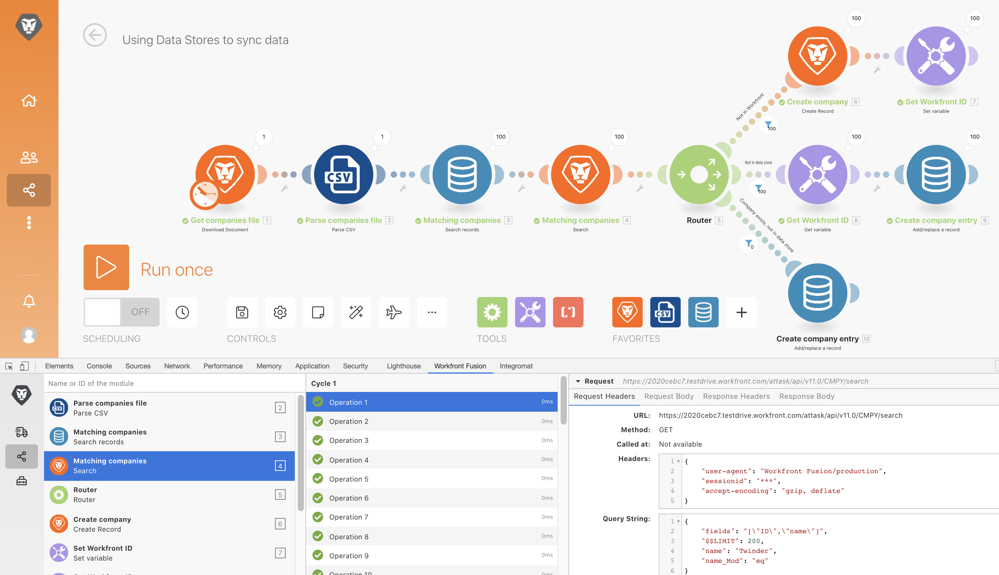
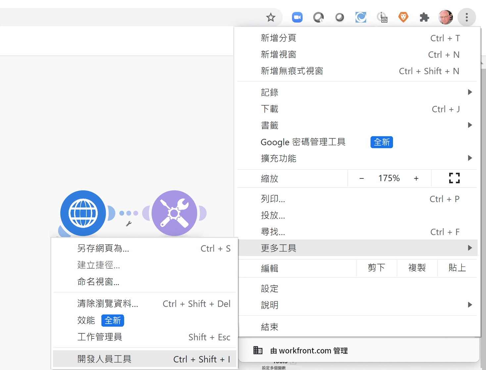

# 開發工具練習

使用開發工具來增強情境疑難排解的能力以及簡化複雜的設定。

## 練習概觀

安裝 Workfront 開發工具並使用其中不同的區域，深入了解所提出請求/回應以及進階的情境設計技巧。

>[!NOTE]
>
>唯有使用 [Chrome 開發者工具](https://developer.chrome.com/docs/devtools/)時，才可以透過 Chrome 瀏覽器使用 Workfront Fusion 開發工具。

## 執行步驟

**安裝開發工具。**

1. 請下載產品試用過程中的「Fusion Exercise Files」資料夾中的文件「workfront-fusion-devtool.zip」。
1. 將 Zip 檔案解壓縮並儲存到資料夾中。
1. 在 Chrome 中開啟一個分頁並輸入 **chrome://extensions**。
1. 使用右上角的開關開啟開發人員模式，然後按一下左上角出現的「載入未封裝」按鈕。選取包含開發工具的資料夾 (這是您把檔案解壓縮的位置)。

   

1. 解壓縮後，開發工具就會出現在其他擴充功能當中。

   

   **使用即時資料流。**

1. 首先開啟「使用資料儲存區來同步資料」情境
1. 輸入 F12 或 function F12 來開啟開發工具。或者您可以按一下 Chrome 網址列的三圓點選單並導覽至「開發者工具」。

   

1. 按一下 Workfront Fusion 標籤，然後從左側清單中選取「即時資料流」。
1. 按一下「執行一次」來查看所出現的事件。
1. 按一下某個事件，可以在右邊看到「請求標題」、「請求內文」、「回應標題」和「回應內文」的標籤。

   

   **使用情境除錯工具**

1. 選取「情境除錯工具」並按一下某個模組，可查看該模組運作的資訊。

   

1. 導覽至「歷史記錄」標籤。按一下執行的「詳細資料」，檢查特定執行的模組運作詳細資料。

   

   **使用工具**

1. 返回情境設計工具並在開發工具中選取「工具」。這將顯示可用的工具。

   

+ 聚焦模組 - 使用模組 ID 快速尋找及開啟模組。
+ 按照對應尋找模組 - 使用關鍵字來搜尋一個情境，找出對應的值和/或模組中的索引鍵。
+ 取得應用程式中繼資料 - 查看在情境中選取的應用程式之中繼資料。
+ 複製對應 - 將對應從一個模組複製到另一個模組。您也可以在設計工具中原地複製模組。
+ 複製篩選器 - 複製篩選器。篩選器總是指派給位在其右邊的模組。
+ 切換連線 - 工具取得所選模組的連線設定，並讓情境中相同應用程式的所有模組均設定相同的連線。如果您必須變更整個已完成情境中的連線時，這項功能極為實用。使用這個工具可以避免失去所有對應並節省時間。
+ 交換變數 - 尋找整個情境中或是一個模組中出現指定變數的所有地方，然後用新的變數取代這些變數。不支援萬用字元。如果您不小心把一個值對應到整個情境中，這個功能可幫助您輕鬆切換成正確的值。
+ 切換應用程式 - 把指定的應用程式切換成另一個應用程式。
+ BASE 64 - 輸入的資料使用 Base64 編碼或解碼。當您要在已編碼的請求中搜尋特定資料時，此功能很有用。
+ 複製模組名稱 - 將所選模組名稱複製到剪貼簿。
+ 重新對應來源 - 將對應來源從一個模組變更為另一個模組。您必須先把要用作來源模組的那個模組新增到情境的執行路徑中。
+ 遷移作業系統 - 專門用於將 Google Sheets (舊版) 模組升級成最新版本的 Google Sheets。在情境執行路徑中，新版本的模組會新增在舊版模組之後。
