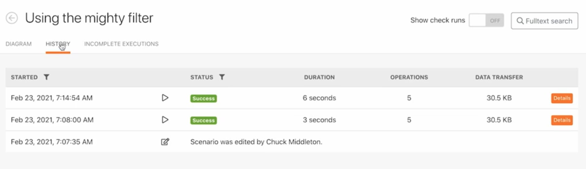

# 執行歷程記錄練習

檢閱和稽核過去的執行記錄和情境設定的詳細資料。

## 練習概觀

檢閱「使用功能強大的篩選器」情境的執行歷史記錄，來瞭解執行時發生什麼事以及他們在執行時的結構。

## 執行步驟

1. 開啟「使用功能強大的篩選器」情境。
1. 在概觀頁面中，按一下「歷史記錄」標籤 (在最上方，情境名稱之下)。

   

1. 尋找一項執行記錄並按一下詳細資料按鈕來開啟頁面，頁面會在右側面板顯示該特定作業已執行 (或未執行)。在左側面板中，您可以檢查情境當時執行的情況。

   

1. 當您對情境面板中的某個模組按一下左鍵，便會出現一個模組檢查程式面板，顯示模組的設定資訊。按一下模組或篩選器旁邊的執行檢查程式，查看之前使用哪一組資訊執行情境。

   

   

1. 在右側面板中，捲動瀏覽或點進「簡單」記錄，「逐步」檢視執行的詳細資料。

   + 您可以查看模組中各項操作的完成時間以及某一批資訊何時通過 (或未通過) 篩選器。

   

   + 按一下記錄項目即可開啟情境面板中的操作面板。記錄依發生時間順序列出。

   

1. 進階記錄顯示相似的資訊。但是其提供更詳細的資訊，包括每個執行回合執行多少個週期，您也可以深入瞭解每個週期處理哪一批資訊。

