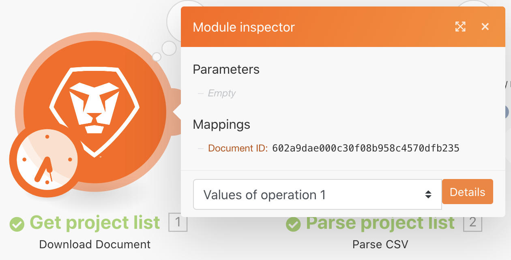

# 執行歷史記錄

檢閱和稽核有關過去執行和情景設定的詳細資訊。

## 練習概述

請檢閱「使用強大篩選器」案例的執行歷史記錄，以瞭解執行時發生的情況以及執行時的結構化。

## 要遵循的步驟

1. 開啟「使用可能篩選器」情境。
1. 在概覽頁面中，按一下歷史記錄標籤（在頂端，在案例名稱下）。

   

1. 尋找執行並按一下詳細資訊按鈕，即可開啟一個頁面，其中顯示已在右側面板中執行（或未執行）的特定操作。 在左側面板中，您可以檢查執行時的情境。

   

1. 當您按一下「案例」面板中的模組時，會出現模組檢測器面板，顯示模組設定的相關資訊。 按一下模組或篩選器旁的執行檢查器，檢視已在哪些資訊組合上執行。

   

   

1. 在右側面板中，捲動瀏覽或按一下簡單記錄，以檢視執行「逐一播放」的詳細資訊。

   + 您可以檢視操作在模組中何時完成，以及套件組合透過（或未透過）篩選器時。

   

   + 按一下記錄專案以開啟案例面板中的操作面板。 記錄會依發生時間順序列出。

   

1. 進階記錄會顯示類似資訊。 不過，它提供有關每次執行多少週期的詳細資訊，並可讓您更深入瞭解在每個週期中處理了哪些資訊組合。

